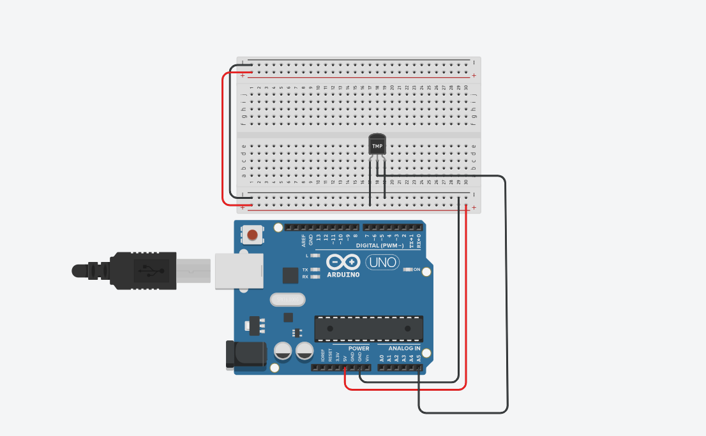
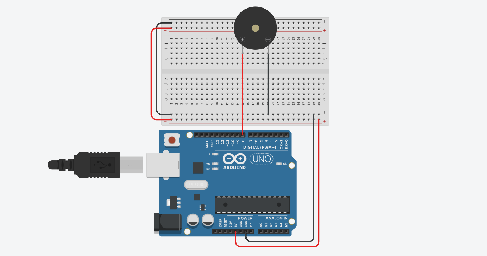

# Arduino Mini Projects Collection

This repository contains **three simple Arduino mini projects** designed to help beginners understand the fundamentals of electronics and programming.  
Each project introduces an essential concept: **sensor input**, **signal output**, and **PWM control**.  
Together, they form a foundation for learning how Arduino interacts with the physical world.

---

##  Project Goals

The purpose of these three projects is to:
- Understand how Arduino reads **analog sensor data** (temperature sensor)
- Learn how to generate **sound frequencies** using a buzzer
- Explore **Pulse Width Modulation (PWM)** to control LED brightness
- Visualize electronic signals with tools such as an **oscilloscope**
- Develop practical skills in building and testing circuits on a **breadboard**

---

## Project 1 — Temperature Sensor (LM35)

### Description
This project reads temperature data from an **LM35 sensor** and prints the temperature value in degrees Celsius (°C) on the Serial Monitor.

### How It Works
The LM35 outputs a voltage proportional to the temperature (10 mV per °C).  
Arduino reads this voltage through its **analog input pin** and converts it into a temperature value using a simple formula.

### Circuit Connections
- **LM35 VCC (Pin 1)** → 5V on Arduino  
- **LM35 Output (Pin 2)** → A5 (analog input)  
- **LM35 GND (Pin 3)** → GND on Arduino  

A jumper wire connects each pin properly to the Arduino board and breadboard.

### What You’ll Learn
- How analog sensors work  
- How to use `analogRead()` and convert voltage to real-world units  
- How to send sensor data to the computer using `Serial.println()`

---

## 🎵 Project 2 — Buzzer Melody Player

### Description
This project plays a short melody using a **passive buzzer** and the `tone()` function.  
It demonstrates how Arduino can generate sound frequencies and play simple tunes.

### Circuit Connections
- **Buzzer Positive (+)** → Digital Pin 8 on Arduino  
- **Buzzer Negative (–)** → GND on Arduino  

If you use a breadboard, make sure the longer leg of the buzzer (positive) goes to **pin 8**, and the shorter leg (negative) goes to **ground**.

### How It Works
- Each musical note is represented by a frequency defined in `pitches.h`  
- The `tone()` function sends a square wave to the buzzer at the desired frequency  
- `delay()` controls the duration and rhythm of the melody  
- `noTone()` stops the sound between notes to separate them clearly  

### What You’ll Learn
- How to generate audio tones with Arduino  
- How timing and rhythm are controlled using code  
- How musical notes correspond to electronic signal frequencies

---

## Project 3 — LED Fading with PWM and Oscilloscope

### Description
This project gradually increases and decreases the brightness of an LED using **Pulse Width Modulation (PWM)**.  
An oscilloscope can be connected to visualize how the PWM waveform changes as the LED fades in and out.

### Circuit Connections
- **LED Anode (long leg)** → Digital Pin 5 (PWM pin)  
- **LED Cathode (short leg)** → One end of a 220Ω resistor  
- **Other end of the resistor** → GND on Arduino  
- **Oscilloscope probe** → Connected across the LED (or between Pin 5 and GND) to observe the PWM waveform  

### How It Works
The Arduino’s `analogWrite()` function rapidly switches the LED pin ON and OFF at different ratios (duty cycles).  
The higher the duty cycle, the longer the LED stays ON during each cycle — making it appear brighter.  
As the duty cycle decreases, the LED appears dimmer.

### What You’ll Learn
- How PWM simulates analog voltage using digital output  
- How LED brightness is controlled smoothly through software  
- How to visualize PWM signals on an oscilloscope  

---

## Learning Outcomes

By completing these projects, you will:
- Gain confidence in wiring and debugging breadboard circuits  
- Understand how sensors and actuators communicate with a microcontroller  
- Learn key Arduino functions like `analogRead()`, `analogWrite()`, `tone()`, `delay()`, and `Serial.begin()`  
- Visualize how software directly affects hardware behavior  

---

## How to Run

1. Open each project’s `.ino` file in the **Arduino IDE**  
2. Select your **board type** (Arduino Uno) and correct **COM port**  
3. Upload the sketch to your board  
4. Observe the output:
   - Serial Monitor for temperature readings  
   - Buzzer playing melody  
   - LED brightness changing (and PWM waveform on oscilloscope)

