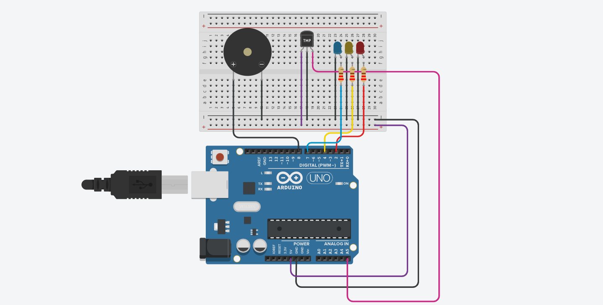
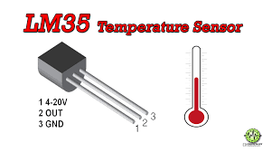
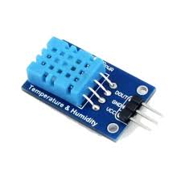

# Arduino Temperature Alert System with LM35 & LED & Buzzer


## Project Overview

This Arduino-based project continuously reads temperature from an analog temperature sensor (LM35 or TMP36) and provides a visual and auditory alert system. Three LEDs indicate temperature ranges (Blue: Normal, Yellow: Medium, Red: High), and a piezo buzzer activates if the temperature exceeds a critical threshold.

## Project Logic and Functionality

The system continuously monitors temperature and provides output according to three levels:

* **Normal Temperature:** (e.g., below 25°C) --> **Blue LED** turns on.
* **Medium Temperature:** (e.g., between 25°C and 30°C) --> **Yellow LED** turns on.
* **High Temperature (Alert):** (e.g., above 30°C) --> **Red LED** turns on and **Piezo buzzer** activates.

### Analog-to-Temperature Conversion Formula

The analog reading from the sensor (connected to A0) is first converted to voltage and then to Celsius temperature:

```
Voltage = (Analog Value * 5.0) / 1024
Temperature (°C) = (Voltage - 0.5) * 100   // for TMP36
Temperature (°C) = Voltage * 100             // for LM35
```

## Hardware Connections

| Component                           | Pin          | Description                               |
| :---------------------------------- | :----------- | :---------------------------------------- |
| **Temperature Sensor (TMP36/LM35)** | A5 (Analog)  | Read analog temperature value             |
| **Red LED**                         | D2 (Digital) | Digital output for high temperature alert |
| **Yellow LED**                      | D4 (Digital) | Digital output for medium temperature     |
| **Blue LED**                        | D7 (Digital) | Digital output for normal temperature     |
| **Piezo Buzzer**                    | D5 (Digital) | Digital output for auditory alert         |
| **All components**                  | GND          | Common ground                             |

## Bill of Materials (BOM)

| Reference  | Qty | Component                       | Description                               |
| :--------- | :-- | :------------------------------ | :---------------------------------------- |
| U4         | 1   | Arduino Uno R3                  | Main microcontroller board                |
| D2         | 1   | Red LED                         | Visual indicator for high temperature     |
| D4         | 1   | Yellow LED                      | Visual indicator for medium temperature   |
| D7        | 1   | Blue LED                        | Visual indicator for normal temperature   |
| R2, R3, R4 | 3   | 220 Ω Resistors                 | Current-limiting resistors for LEDs       |
| U5         | 1   | Temperature Sensor [TMP36/LM35] | Analog sensor for temperature measurement |
| PIEZO2     | 1   | Piezo Buzzer                    | Auditory alert                            |

## Sensor Choice Note

While this project uses an analog temperature sensor (LM35/TMP36), it could have been implemented more effectively with a **DHT11 temperature and humidity sensor**.

The reasons are:

* **Digital Output:** DHT11 provides a digital signal, which is less noisy and more stable compared to the 10-bit analog output of LM35.
* **Faster Response:** DHT11 delivers temperature and humidity readings quickly.
* **Humidity Measurement:** DHT11 can measure humidity in addition to temperature, providing more environmental data.

However, the DHT11 sensor was not used in this project because it is **not available in the Tinkercad simulation environment**. Therefore, LM35/TMP36 was chosen as a suitable alternative for demonstrating temperature monitoring.

## Temperature Sensors

### LM35 / TMP36
This is how the LM35/TMP36 sensor looks:



### DHT11
This is how the DHT11 temperature and humidity sensor looks:




## Notes

* Adjust threshold temperatures in the code according to your requirements.
* Ensure current-limiting resistors are used with LEDs.
* The project works with both TMP36 and LM35; modify the conversion formula accordingly.

