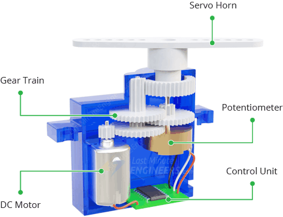

# Introduction To I2C Communication

**I2C**, **I²C**, or **IIC** (*Inter-Integrated Circuit*) is a very popular **serial communication protocol** that’s widely used by different sensors and modules in embedded systems.  
It consists of **2 pins only** (one for serial data and one for the serial clock). Hence the name, **TWI (Two-Wire Interface)**.

---

> Note
The I2C Pins (**SDA** and **SCL**) are the Arduino analog input pins **A4** and **A5** respectively.  
If you’re going to use the Arduino I2C communication, you’ll not be able to use those 2 pins as analog input channels for the ADC or whatever.

---

## Arduino I2C Speed (Frequency)
The default Arduino I2C Speed is **100kHz**, and it can be increased up to a maximum of **400kHz** as stated earlier.

---

## Arduino I2C Applications
There are so many modules and sensors that we can interface with Arduino using the I2C bus, which include (but are not limited to):
- LCD displays
- Real Time Clocks (RTC)
- EEPROM modules
- Temperature sensors (e.g., LM75, BME280)
- MPU6050 accelerometer & gyroscope
- And many more...

---

##  Arduino Wire Library (I2C Library)
To use Arduino’s I2C module, we’ll be using the **built-in Wire library**.  
This library handles all initialization and operations that you’d need to perform with the I2C serial communication.

###  Wire Include
To be able to use the I2C Wire library, include it as shown below:
```cpp
#include <Wire.h>
```
## Arduino I2C Setup Functions (Wire Library)

First of all, you need to initialize the serial I2C module using the Wire.begin() function.
It can initialize the I2C as a master device or as a slave device.

For master initialization:
``` cpp
Wire.begin();     // Initialize As A Master I2C Device
```
For slave initialization (with address = 0x0A):
```cpp
Wire.begin(0x0A); // Initialize As A Slave I2C Device With Address = 0x0A
```
### Wire.end()

Disables the Wire library, reversing the effect of Wire.begin().
To use the Wire library again after this, call Wire.begin() again.

This function can be helpful if you want to switch the I2C operation mode from master to slave (or vice versa) during runtime without restarting the whole microcontroller.
This may be a rare condition, but it’s doable.
# Arduino I2C LCD Interfacing

Now, let’s move to interfacing the **I2C LCD 16×2 display** with Arduino.  
We’ll cover the **pinout**, **wiring diagram**, **LCD contrast control**, and the **I2C LCD device address**.

---

##  I2C LCD Pinout

| Pin | Description |
|-----|-------------|
| **GND** | Ground pin |
| **VCC** | Power supply input pin (+5V) |
| **SDA** | Serial Data Line for I2C LCD interface |
| **SCL** | Serial Clock Line for I2C LCD interface |

---

##  Wiring I2C LCD With Arduino

Here is the wiring diagram for the I2C LCD display with Arduino:


### Example Code
```cpp
#include <Wire.h>
#include <LiquidCrystal_I2C.h>

LiquidCrystal_I2C MyLCD(0x27, 16, 2); // Creates I2C LCD Object (Address=0x27, Cols=16, Rows=2)

void setup() {
  MyLCD.init();        // Initialize the LCD
  MyLCD.backlight();   // Turn on backlight

  MyLCD.setCursor(0, 0); // (Column, Row)
  MyLCD.print("Counter Value:");
}

void loop() {
  // Example: Display counter or sensor data here
}
```
> This setup allows you to display messages easily on a 16×2 LCD using only two communication lines (SDA and SCL), making your wiring cleaner and freeing up Arduino pins for other components.

##  Summary Table

| Feature / Concept         | Details / Value |
|---------------------------|----------------|
| Communication Protocol    | I2C (Two-Wire Interface) |
| I2C Pins on Arduino       | SDA = A4, SCL = A5 |
| Default I2C Speed         | 100 kHz |
| Maximum I2C Speed         | 400 kHz |
| Arduino Library           | Wire.h, LiquidCrystal_I2C.h |
| LCD Size                  | 16×2 characters (2 rows × 16 columns) |
| LCD Backlight Control     | MyLCD.backlight() |
| LCD Initialization        | MyLCD.init() |
| Cursor Positioning        | MyLCD.setCursor(column, row) |
| Display Text              | MyLCD.print("Your Text") |
| Advantages of I2C LCD     | Fewer wires, multiple modules on one bus, saves Arduino pins |

# Servo Motor

A **servo motor** is an electric device used to control **angular rotation**.  
It can be a **rotary actuator** or a **linear actuator**. Servo motors have a **servomechanism** that helps control and monitor the motion of the motor.  
Users can precisely control the **rotation speed** and **position (angle)**.

---

## Servo Motor Pins

A typical servo motor has **3 pins**:

| Pin    | Description         |
|--------|-------------------|
| VCC    | 5 Volts Power Supply |
| GND    | Ground            |
| Signal | Control Input Signal |

---

##  Servo Motor Configuration

1. Connect the **Signal pin** of the servo motor to a vacant **PWM pin** of the Arduino.  
2. Connect the **VCC** of the servo motor to the **5V pin** on Arduino.  
3. Connect the **GND** of the servo motor to Arduino **GND**.  
4. Import the **Servo library** in your Arduino code.  
5. Compile and upload the code to the Arduino Uno R3.

---

##  What Makes a Servo Precise?

Inside a typical hobby servo motor, there are **five main components**:

| Component      | Function |
|----------------|---------|
| **DC Motor**   | Provides the rotational force; connects to output shaft through gears. |
| **Gearbox**    | Increases torque and improves precision; reduces speed but strengthens rotation. |
| **Servo Horn** | Plastic arm attached to the output shaft; used to attach objects to move. |
| **Potentiometer** | Variable resistor that acts as a position sensor; connected to output shaft to detect rotation. |
| **Control Unit**  | Receives signals from Arduino, reads potentiometer, and controls the DC motor. |



---

##  How Servo Motors Work

Hobby servo motors are controlled using **Pulse Width Modulation (PWM)**:

- Pulses are sent at regular intervals, typically **50 times per second (50 Hz)** → one pulse every **20 ms**.  
- **Pulse width** (duration of the pulse) determines the servo’s position.  
- The control unit reads the pulse width and moves the motor shaft to the corresponding angle.

>  For example, a pulse of ~1 ms may move the servo to 0°, ~1.5 ms to 90°, and ~2 ms to 180°.

---
##  Servo Motor Summary Table

| Feature / Concept          | Details / Value |
|----------------------------|----------------|
| Device Type                | Servo Motor (Rotary / Linear Actuator) |
| Control Method             | PWM (Pulse Width Modulation) |
| PWM Frequency              | 50 Hz (20 ms per pulse) |
| Pins                       | VCC (5V), GND, Signal (PWM input) |
| Arduino Connection         | Signal → PWM Pin, VCC → 5V, GND → GND |
| Main Components            | DC Motor, Gearbox, Servo Horn, Potentiometer, Control Unit |
| Position Control           | Pulse width (1–2 ms) |
| Rotation Angle Range       | Typically 0°–180° |
| Precision                  | High, due to potentiometer feedback and gearbox |
| Arduino Library            | Servo.h |
| Example Command            | `myservo.write(angle);` |
| Typical Applications       | Robotic arms, automatic doors, model planes, pan-tilt cameras |

##  References / Sources

### I2C LCD
1. [Arduino I2C Tutorial & Examples – DeepBlu Embedded](https://deepbluembedded.com/arduino-i2c-tutorial-examples/)  
2. [Arduino I2C LCD – DeepBlu Embedded](https://deepbluembedded.com/arduino-i2c-lcd/#arduino-i2c-lcd)  
3. [Arduino Serial Communication – DeepBlu Embedded](https://deepbluembedded.com/arduino-serial-communication/)

### Servo Motor
1. [Servo Motor Interfacing and Control using Arduino – GeeksforGeeks](https://www.geeksforgeeks.org/electronics-engineering/servo-motor-interfacing-and-control-using-arduino/)  
2. [Servo Motor Arduino Tutorial – Last Minute Engineers](https://lastminuteengineers.com/servo-motor-arduino-tutorial/)  
3. [Arduino Servo Motors – Instructables](https://www.instructables.com/Arduino-Servo-Motors/)


