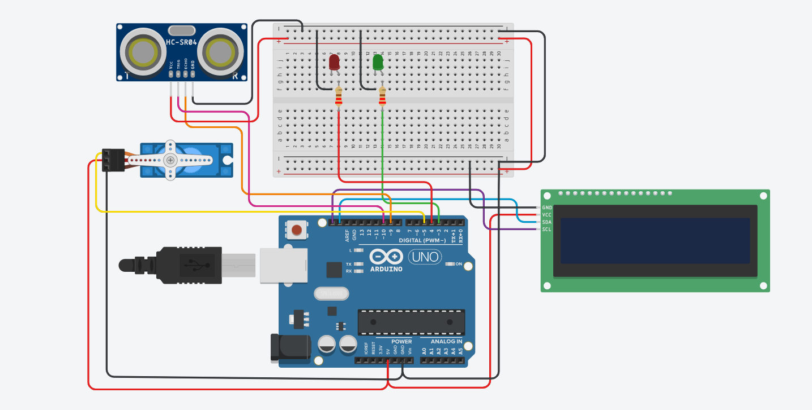

# Circuit Diagram / Wiring
the wiring diagram for the **Automatic Door System**:

# Automatic Door Opening and Closing System

This project is an **automatic door system** using an **Arduino UNO**, an **ultrasonic sensor**, **red and green LEDs**, a **16x2 LCD with I2C**, and a **servo motor**.  
The door **opens automatically** when a person is detected within a threshold distance and **closes after 5 seconds**.

---

## Features

- **Automatic Door Control:** Opens when a person is detected and closes after a set duration.  
- **Distance Measurement:** Uses an **ultrasonic sensor** to detect presence.  
- **Status Indicators:** Red and green LEDs show door status (closed/open).  
- **LCD Display:** 16x2 LCD shows door status and remaining time before closing.  
- **Adjustable Parameters:** Threshold distance and open duration can be configured in code.

---

## Components Required

| Component                | Quantity | Notes |
|---------------------------|---------|-------|
| Arduino UNO              | 1       | Microcontroller board |
| Ultrasonic sensor (HC-SR04)| 1     | For distance measurement |
| Servo motor               | 1       | Controls door movement |
| Red LED                   | 1       | Indicates door closed |
| Green LED                 | 1       | Indicates door open |
| 16x2 LCD with I2C         | 1       | Display door status |
| Resistors                 | 2       | 220Ω for LEDs |
| Breadboard                | 1       | For connections |
| Connecting wires          | As needed | For all components |

---

##  Connections

| Component             | Pin Connections |
|-----------------------|----------------|
| **Ultrasonic Sensor** | VCC → 5V, GND → GND, Trig → D9, Echo → D10 |
| **Servo Motor**       | VCC → 5V, GND → GND, Signal → D3 (PWM Pin) |
| **Red LED**           | Anode → D4, Cathode → GND (via 220Ω resistor) |
| **Green LED**         | Anode → D5, Cathode → GND (via 220Ω resistor) |
| **16x2 LCD with I2C** | SDA → A4, SCL → A5, VCC → 5V, GND → GND |

---

##  Why Use PWM for Servo Motor?

- **PWM (Pulse Width Modulation)** allows precise control of the **angular position** of the servo.  
- Digital pins on Arduino generate **PWM signals**, which vary the **pulse width** to set the servo angle.  
- Regular digital HIGH/LOW signals cannot control a servo’s exact position.  
- Example:  
  - 1 ms pulse → 0°  
  - 1.5 ms pulse → 90°  
  - 2 ms pulse → 180°  

> ✅ Only PWM-enabled pins (D3, D5, D6, D9, D10, D11 on Arduino UNO) can be used for servo signal input.

---

##  Additional Notes

- Ensure **power supply** is stable; high-current servo movements can reset Arduino if powered from the 5V pin directly.  
- Keep **ultrasonic sensor** away from obstacles for accurate distance measurement.  
- Use **appropriate resistors** for LEDs to prevent burning them out.  
- Adjust **threshold distance** and **door open duration** in the code for different setups.  
- LCD I2C makes wiring simpler: only **SDA and SCL** are required, freeing Arduino pins.  

