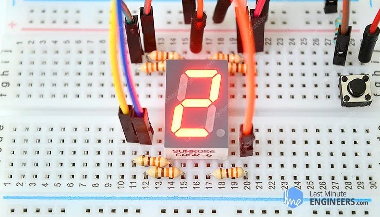

# Wiring Common Cathode Seven Segment Display to Arduino UNO

##  Project Overview
This project demonstrates how to control a **7-segment display** using an **Arduino Uno** in **Tinkercad**.  
The goal is to display numeric digits (0–9) by turning ON/OFF the individual LED segments inside the module.

---
##  Components Used

| Component | Quantity | Notes |
|----------|----------|------|
| Arduino Uno R3 | 1 | Main controller |
| 7-Segment Display (Common Cathode) | 1 | Single-digit module |
| 500 Ω Resistors | 8 | One per segment (including DP if used) |
| Jumper Wires | Several | Connections |
| Breadboard | 1 | Circuit assembly | 

---

## Wiring (Common Cathode)

| Segment | Arduino Pin |
|--------|-------------|
| A | D5 |
| B | D4 |
| C | D10 |
| D | D11 |
| E | D12 |
| F | D6 |
| G | D8 |
| DP | D9 (not used) |
| COM pins | GND |

---

##  What is a 7-Segment Display?
A 7-segment display is an electronic display device commonly used to show numeric characters.  
It consists of **7 LEDs** shaped like line segments to form numbers, plus an optional **Decimal Point (DP)**.

Each LED segment is labeled: A, B, C, D, E, F, G.  
Different combinations of ON/OFF segments form different digits.

Example:  
- Number **1** → only segments **B** and **C** turn ON  
- Number **8** → all segments turn ON

## 7-Segment Display Pinout 

  

---

## Types of 7-Segment Displays
There are **two common types**:

| Type | Description | Power Logic |
|------|-------------|-------------|
| **Common Cathode (CC)** | All negative terminals are tied together internally | COM → GND, segment pins must receive HIGH to turn ON |
| **Common Anode (CA)** | All positive terminals are tied together internally | COM → +5V, segment pins must receive LOW to turn ON |

### Common Cathode (CC) Displays

### Common Anode (CA) Displays

✅ In this project, we are using a **Common Cathode** 7-segment display.

---

##  How it Works Electrically
Each segment is an LED. To control brightness and protect the display:
✅ A current-limiting resistor must be placed in series with each segment.

### Basic current flow for CC type:
- Arduino Pin (HIGH) → Resistor → Segment LED → COM → GND

### If the display were **Common Anode**, the logic would reverse:
- Arduino Pin (LOW) → Resistor → Segment LED → COM (+5V)
  
##  What would change if we used a different type?
| Change | What you need to modify |
|--------|------------------------|
| Switching to Common Anode | Connect COM to +5V and invert segment signal logic in the program |
| Different pin configuration | Update wiring and segment mapping in the code |
| Multi-digit display | Use multiplexing (rapid switching between digits) |

