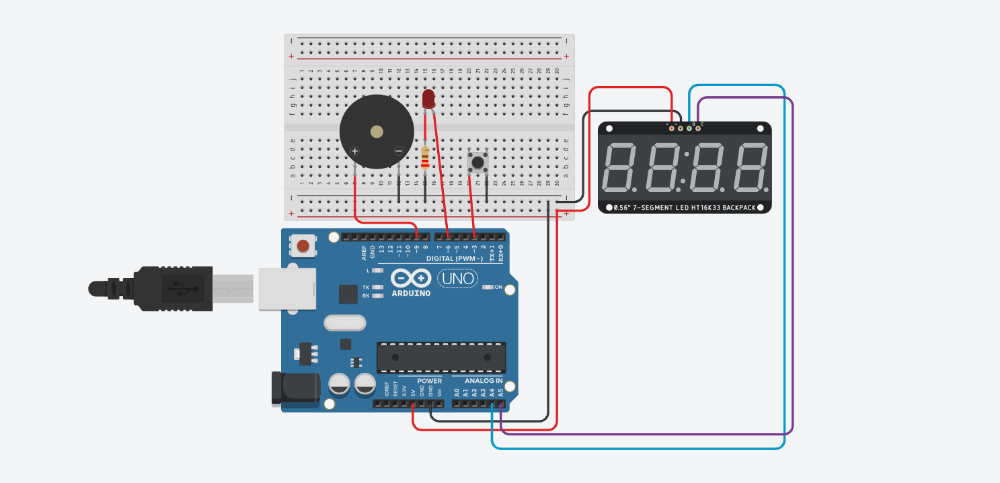

# Wiring Common Cathode Seven Segment Display to Arduino UNO

# Auto-Start Countdown Timer with Continuous Alarm

## 1. Project Objective
Build a digital countdown timer that:

- Starts counting automatically when the Arduino powers on
- Displays the remaining time on an HT16K33 7-segment display
- Triggers a continuous buzzer and blinking LED alarm when the timer reaches zero
- Uses a single button to stop the alarm completely
- Covers digital output, PWM, and I2C communication

---

## 2. Required Components (Tinkercad)

| Component               | Quantity |
|-------------------------|----------|
| Arduino Uno             | 1        |
| HT16K33 7-segment display| 1       |
| Active Buzzer           | 1        |
| LED (preferably red)    | 1        |
| Push Button (Stop Alarm)| 1        |
| 220Ω resistor for LED   | 1        |
| Wires                   | Several  |

---

## 3. Hardware Wiring

### HT16K33 I2C Connections
| Arduino | HT16K33 |
|---------|---------|
| 5V      | POWER   |
| GND     | GND     |
| A4      | SDA     |
| A5      | SCL     |

### Buzzer
| Arduino | Buzzer  |
|---------|--------|
| D9      | Positive|
| GND     | Negative|

> Use PWM-capable pin D9 for tone generation.

### LED with PWM
| Arduino | LED     |
|---------|--------|
| D6      | Anode via 220Ω resistor |
| GND     | Cathode                  |

### Stop Button (Digital Input)
- Connect one side of the button to digital pin D3
- Connect the other side to GND
- Enable internal pull-up resistor in code (`INPUT_PULLUP`)

---

## 4. Software Behavior Step-by-Step

### Countdown Mode
- Timer starts automatically from a preset value
- Countdown decreases by 1 every second
- Display updates continuously

### End Alarm Mode
- When the timer reaches zero:
  - Buzzer sounds continuously
  - LED blinks with PWM effect
  - Timer remains stopped until the **Stop button** is pressed
- Pressing the Stop button:
  - Turns off the buzzer and LED
  - Halts the program completely (timer does not resume)

---

## 5. Programming Notes

| Topic            | Explanation |
|------------------|------------|
| I2C              | Controls the 7-segment display |
| Pull-up          | Reads the Stop button without an external resistor |
| PWM              | Controls LED blinking/visual effect |
| millis()         | Provides precise 1-second countdown without blocking program |
| Main variables   | Timer value, alarm state, button debounce, LED toggle state |

---

## 6. Tasks to Complete

1. Wire the hardware as described in section 3
2. Include the required libraries:
   - `Adafruit GFX`
   - `Adafruit LED Backpack`
3. Define the timer variable
4. Implement countdown using `millis()`
5. Update the display
6. Activate LED and buzzer alarm when timer reaches zero
7. Implement **Stop button** functionality to completely halt the program

---

## 7. Suggested Additional Activities

- Display **minutes:seconds (MM:SS)** on the 7-segment display for better readability  
- Create a visually appealing LED + buzzer alarm pattern using PWM and `tone()`  
- Add **EEPROM storage** to save default timer value across power cycles
