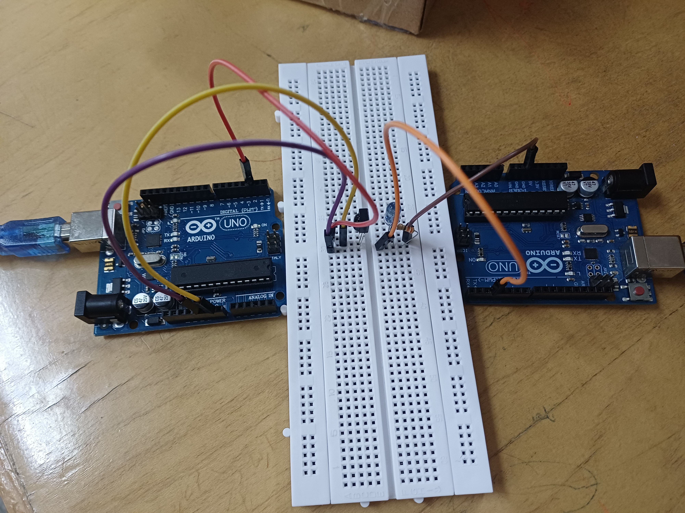
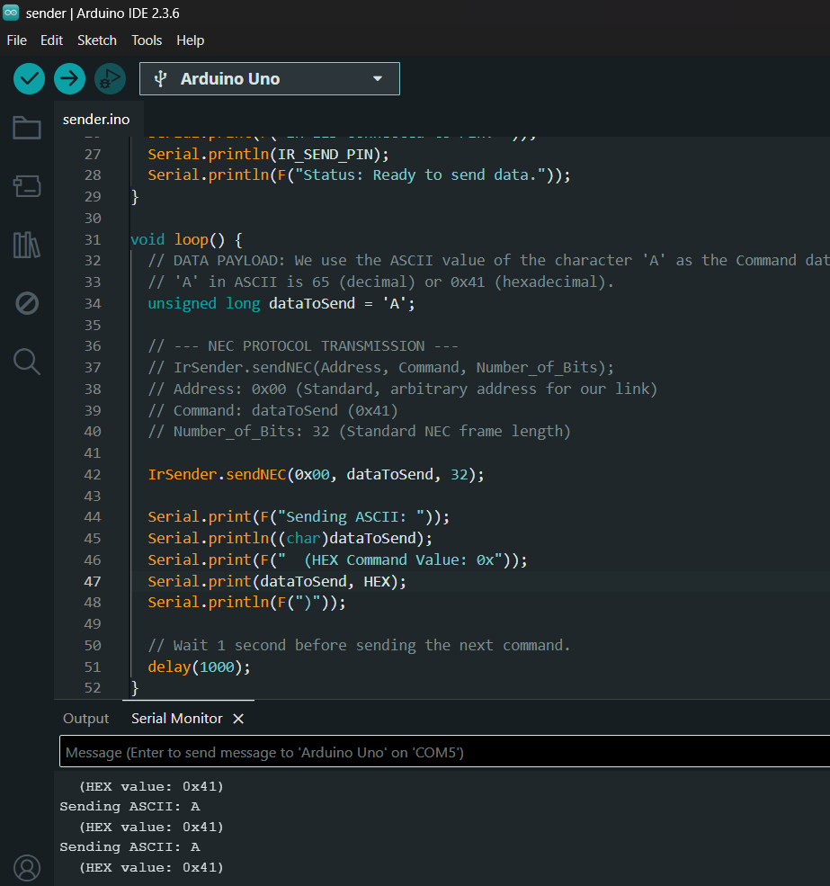
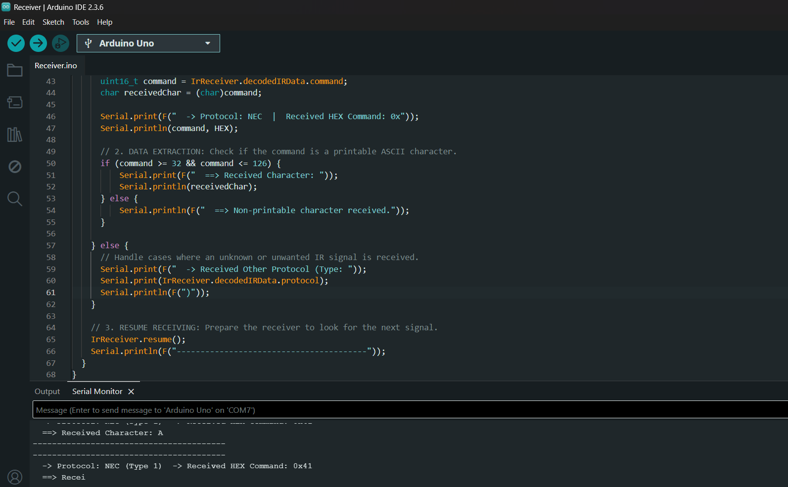
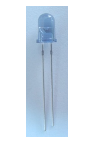
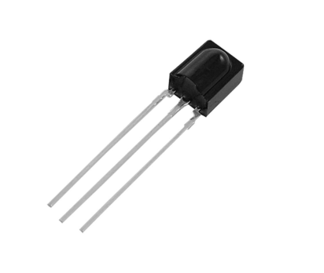

#   Serial Communication Link Circuit


# Arduino Infrared (IR) Serial Link

This project demonstrates a simple and robust **wireless serial communication link** between two Arduino boards using **Infrared (IR)** technology and the **NEC protocol**.  
It implements a basic digital data transmission system using an **IR LED (IR333)** and an **IR receiver module (VS838)**.

---

## Project Overview

The goal of this project is to reliably send a simple character (e.g., `'A'`) from one Arduino (Sender) to another (Receiver).  
The system uses the **NEC protocol** and a **38 kHz carrier frequency** to reduce noise from ambient light.

- **Protocol:** NEC (32-bit data frame)  
- **Carrier Frequency:** **38 kHz** (managed by the IRremote library)  
- **Data Sent:** ASCII character `'A'` (**0x41**)

---

## Prerequisites

### Hardware Components

| Component | Quantity | Description |
|------------|-----------|-------------|
| Arduino Uno | 2 | One for Sender, one for Receiver |
| IR LED | 1 | **IR333** (Peak Wavelength: **940 nm**) |
| IR Receiver Module | 1 | **VS838** (Carrier frequency **38 kHz**) |
| Resistor | 1 | **270 Ω** or **330 Ω** (current-limiting for the IR LED) |
| Breadboards / Wires | – | For circuit assembly |

### Software / Libraries

- **Arduino IDE**  
- **IRremote Library:** (Version 3.x or later recommended)  
  Install via:  
  `Sketch > Include Library > Manage Libraries...`  
  Then search for **"IRremote"**

---

##  Circuit Diagram and Wiring

### 1.  IR Sender Circuit

To generate the **38 kHz** carrier signal, connect the IR LED to **Pin 3** (supports PWM).

- IR LED **Anode (long leg)** → **330 Ω resistor**  
- Resistor output → **Digital Pin 3**  
- IR LED **Cathode (short leg)** → **GND**

---

### 2.  IR Receiver Circuit

The **VS838** module needs no external components—just proper power and signal connections.

- **VCC (right pin)** → **5 V**  
- **GND (middle pin)** → **GND**  
- **OUT (left pin)** → **Digital Pin 2**

---
#  What is the NEC Protocol?

**NEC** (short for **Nippon Electric Corporation**) is one of the most widely used and standardized **Infrared (IR) communication protocols**.  
It’s commonly found in **TV**, **DVD**, and **set-top box** remote controls due to its simplicity, reliability, and noise immunity.

---

##  Key Features of the NEC Protocol

| Feature | Description | Importance in Our Code |
|----------|--------------|------------------------|
| **Data Frame** | 32-bit data frame. | `IrSender.sendNEC(..., 32)` handles full 32-bit transmission. |
| **Carrier Frequency** | **38 kHz** modulation frequency. | Prevents interference from ambient light — the **VS838** receiver only detects 38 kHz signals. |
| **Frame Structure** | `8-bit Address` + `8-bit Address Invert` + `8-bit Command` + `8-bit Command Invert`. | For simplicity, we use static or zeroed address fields. |
| **Bit Order** | **LSB First** (Least Significant Bit sent first). | Automatically handled by `sendNEC()`. |

### 1. Sender Code (`Sender.ino`)

This code sends the ASCII character `'A'` (**0x41**) every second using the NEC protocol with address **0x00**.

#### Sender Code Analysis

| Line / Statement | Function |
|------------------|-----------|
| `#include <IRremote.h>` | Includes the IRremote library which generates the 38 kHz signal and handles NEC timing. |
| `#define IR_SEND_PIN 3` | Sets **pin 3** (PWM-capable) for the IR333 transmitter. |
| `IrSender.begin(IR_SEND_PIN, ...)` | Initializes the IR sender and configures background PWM generation at 38 kHz. |
| `unsigned long dataToSend = 'A';` | The data to be transmitted — character `'A'` (ASCII 65 or `0x41`). |
| `IrSender.sendNEC(0x00, dataToSend, 32);` | The core transmission function that encodes and sends the 32-bit NEC frame. |


#### Output of Sender

Below is what the output of the Sender looks like in the Arduino Serial Monitor:



---

### Receiver Code Analysis (`Receiver.ino`)

The receiver demodulates the IR signal from the **VS838** and reconstructs the original 32-bit NEC data frame.

### Working Principle

1. **Signal Detection:**  
   The **VS838** continuously monitors incoming light. When a 38 kHz signal is detected, it converts it to a clean digital signal.

2. **Decoding Process:**  
   The function `IrReceiver.decode()` measures the timing of pulses — identifying the **9 ms + 4.5 ms** leader, and then interpreting each bit (based on pulse length) as **0** or **1**.

3. **Reconstruction:**  
   The decoded 32-bit frame is stored inside the `IrReceiver.decodedIRData` structure.
```cpp
uint16_t command = IrReceiver.decodedIRData.command;
char receivedChar = (char)command;
```
#### Output of Reciver

Below is what the output of the Reciver looks like in the Arduino Serial Monitor:



## IR Components Reference

| Component | Image | Description | Datasheet |
|------------|--------|--------------|------------|
| **IR LED (IR333)** |  | High-efficiency 940 nm infrared LED used as the transmitter. | [IR333 Datasheet (Everlight)](https://docs.particle.io/assets/datasheets/makerkit/ir333-a.pdf) |
| **IR Receiver (VS838)** |  | 38 kHz IR receiver module used to decode NEC signals. | [VS838 Datasheet (Vishay)](https://www.sivago.com.cn/upload/pdf/2022/VS838(HK).pdf) |


##  Summary

The **NEC protocol** enables reliable IR communication by using:

- **38 kHz carrier modulation** — filters out ambient light interference.  
- **32-bit structured data frames** — includes address, command, and their inverted copies for error checking.  
- **Precise pulse timing** — ensures accurate bit interpretation.  
- **IRremote library** — automatically handles encoding, decoding, and timing for NEC signals.

Together, these allow the Arduino **Sender** and **Receiver** to transmit and decode characters (like `'A'`) accurately, forming a simple yet robust **infrared serial communication link**.

