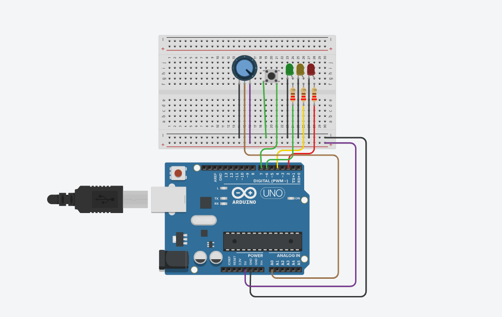
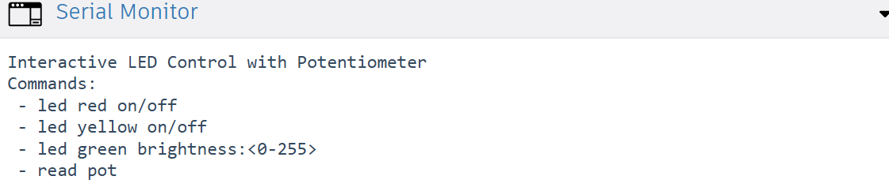

# Arduino Interactive LED Control Project

## Project Goal
This project allows the user to control multiple LEDs via the Serial Monitor and a push button, and also adjust the brightness of a green LED using a potentiometer.

In essence, it's a combined digital and analog control system that involves user interaction and input reading.

## Project Components


### Red and Yellow LEDs (Digital Output)
* Can be turned ON or OFF.
* Their status is controlled by the user via the Serial Monitor using `led red on/off` and `led yellow on/off` commands.
* The push button can also toggle (ON ↔ OFF) the state of both the red and yellow LEDs.

### Green LED (PWM / Analog Output)
* The brightness of the green LED is controlled using Pulse Width Modulation (PWM).
* The user can directly set the brightness with the command `led green brightness:<0-255>`.
* Alternatively, turning the potentiometer (which replaces an LDR in this setup) automatically changes the green LED's brightness.

### Potentiometer (Analog Input)
* The analog pin A0 sends values ranging from 0 to 1023 to the Arduino.
* The read value is mapped (`map()`) to the 0-255 range for PWM and then used to control the green LED's brightness.

### Push Button (Digital Input)
* When pressed, it toggles the state of both the red and yellow LEDs (ON ↔ OFF).
* `INPUT_PULLUP` is used, meaning the pin is HIGH when the button is not pressed and LOW when it is.

### Serial Monitor
* The user enters commands here.
* The Arduino reads the full command using `Serial.readString()` and acts accordingly.
* `Serial.print()` and `Serial.println()` are used to display information, LED states, or potentiometer readings.



## Code Logic Breakdown

### Reading the Push Button
* Checks if the button is pressed.
* If pressed, it toggles the state of the red and yellow LEDs (`ledRedState`, `ledYellowState`) and prints a confirmation message to the Serial Monitor.

### Reading Serial Commands
* Arduino checks for incoming data with `Serial.available()`.
* The complete command is read using `Serial.readString()` and cleaned with `trim()`.

### Processing User Commands (Switch Case)
* **Red and Yellow LED commands:** Turn ON or OFF (using `digitalWrite`) and update the corresponding state variables (`ledRedState` / `ledYellowState`).
* **Green LED brightness command:** Extracts the numeric value from the command, constrains it to 0-255, and applies PWM using `analogWrite`.
* **Potentiometer read command:** Reads the analog value (`analogRead`), prints the raw value, maps it to a PWM range (`map()`), and applies it to the green LED.

## Final Outcome
* The red and yellow LEDs are controlled by either the Serial Monitor commands or the push button.
* The green LED's brightness can be adjusted via Serial commands or automatically by the potentiometer.
* The user can monitor the status of each LED and the potentiometer value through the Serial Monitor.

This project perfectly demonstrates a comprehensive digital and analog combination with user interaction, effectively showcasing the concepts of:
* `digitalRead` / `digitalWrite`
* `analogRead` / `analogWrite`
* `Serial.readString` / `Serial.print` / `Serial.println`
* Ternary operator and PWM control

# Arduino Serial and I/O Lesson

This lesson covers the most important functions for serial communication and reading/writing digital and analog signals in Arduino. **Its purpose is to provide a deeper understanding of working with Arduino and its fundamental input/output operations, preparing learners for more advanced projects.** It's designed to help understand the core concepts before working on advanced projects.

## 1️. Serial Communication

### a) Serial.readString()

* **Definition:** Reads the complete string from the serial buffer until a terminating character (like `\n`) is received or a timeout occurs.
* **Features:**

  * Waits for the complete data to arrive or until the timeout expires.
  * Default timeout: 1000 milliseconds.
* **Example:**

```cpp
if (Serial.available()) {
  String cmd = Serial.readString(); // Read complete command
  cmd.trim();                       // Remove extra spaces and newlines
  Serial.println("You typed: " + cmd);
}
```

* **Usage:** Sending commands like `on`, `off`, `brightness:128` and processing them.

### b) Serial.write()

* **Definition:** Sends data as raw bytes or a byte array through the serial port.
* **Features:**

  * Can send binary data or text.
  * Used for sending information to other devices or computers.
* **Example:**

```cpp
char c = 65;
Serial.write(c); // Send character 'A' as binary
```

* **Difference from Serial.print():**

  * `Serial.print()` sends human-readable ASCII text.
  * `Serial.write()` sends binary/raw data.

---

## 2️. Digital Read / Write

### a) digitalWrite(pin, value)

* **Definition:** Sets a digital pin to HIGH or LOW.
* **Example:**

```cpp
pinMode(LED_BUILTIN, OUTPUT);
digitalWrite(LED_BUILTIN, HIGH); // Turn on LED
digitalWrite(LED_BUILTIN, LOW);  // Turn off LED
```

### b) digitalRead(pin)

* **Definition:** Reads the state of a digital pin (HIGH or LOW).
* **Example:**

```cpp
pinMode(2, INPUT);
int buttonState = digitalRead(2);
if(buttonState == HIGH) {
  Serial.println("Button pressed");
}
```

---

## 3️. Analog Read / Write

### a) analogRead(pin)

* **Definition:** Reads the value of an analog pin (0 to 1023).
* **Example:**

```cpp
int sensorValue = analogRead(A0); // Read LM35 sensor or potentiometer
Serial.println(sensorValue);
```

* **Explanation:** Analog pins convert voltages from 0 to 5V into integer values from 0 to 1023.

### b) analogWrite(pin, value)

* **Definition:** Sends a PWM signal (0 to 255) to a digital pin with PWM capability.
* **Example:**

```cpp
analogWrite(9, 128); // Set LED brightness to 50%
```

* **Explanation:** The actual voltage varies from 0 to 5V depending on the value (0–255), controlling LED brightness or motor speed.

---

## 4️. Summary Table

| Function            | Data Type      | Purpose                           | Example Use              |
| ------------------- | -------------- | --------------------------------- | ------------------------ |
| Serial.readString() | String         | Read complete command from serial | Read "on" to turn LED on |
| Serial.write()      | byte           | Send binary or character data     | Send 'A' to computer     |
| digitalRead()       | int (HIGH/LOW) | Read digital pin state            | Check button status      |
| digitalWrite()      | -              | Set digital pin HIGH/LOW          | Turn LED on/off          |
| analogRead()        | int (0–1023)   | Read analog pin                   | Read LM35 sensor value   |
| analogWrite()       | 0–255          | Send PWM signal to digital pin    | Adjust LED brightness    |

