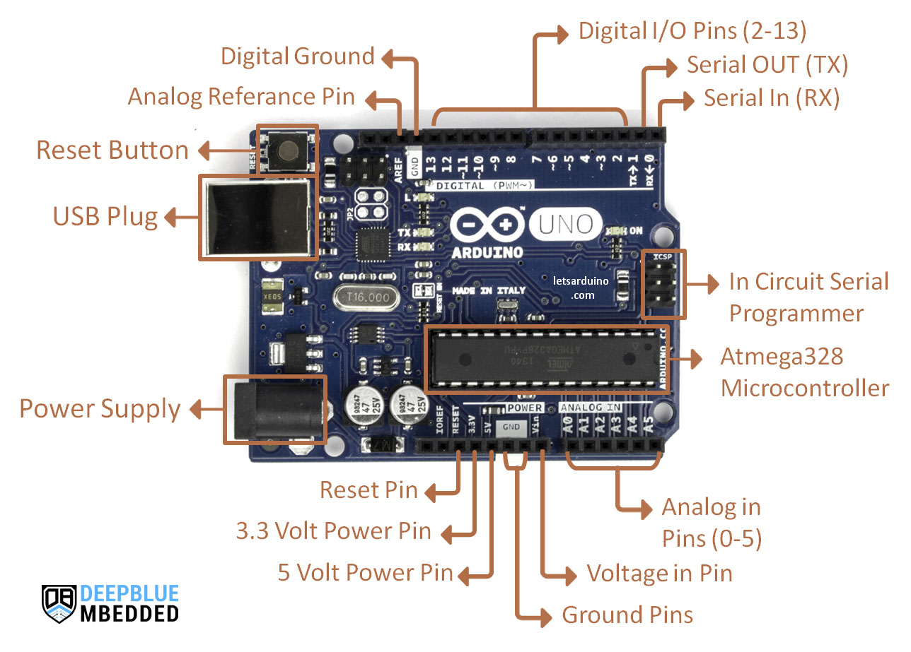
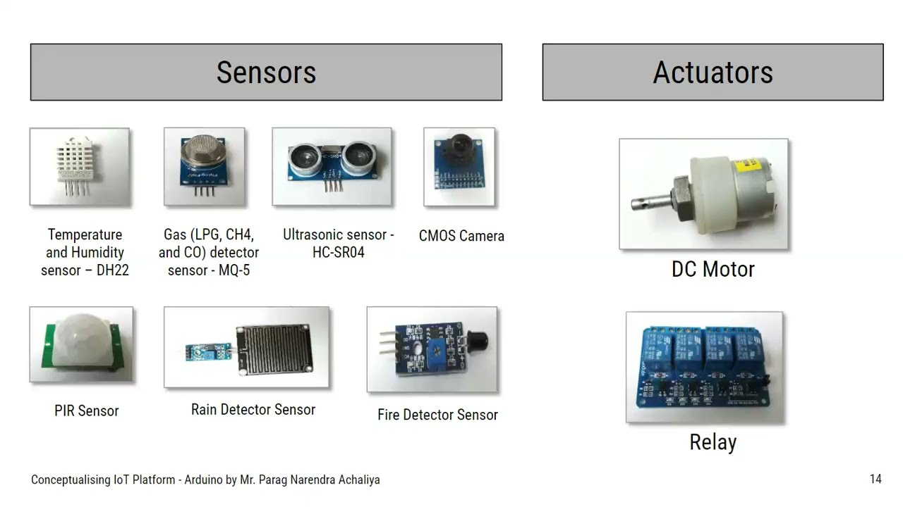

#  Introduction to Arduino

Welcome to **Introduction to Arduino** — a beginner-friendly overview of the Arduino platform.  
This guide will help you understand what Arduino is, how it works, and why it’s one of the best tools to start learning **electronics and programming**.
---
# Table of Contents

- [Introduction to Arduino](#introduction-to-arduino)
  - [What Is Arduino?](#what-is-arduino)
  - [Anatomy of an Arduino Board](#anatomy-of-an-arduino-board)
  - [Basic Operation](#basic-operation)
  - [Circuit Basics](#circuit-basics)
    - [Breadboard Overview](#breadboard-overview)
  - [Electronic Signals](#electronic-signals)
    - [Analog Signal](#analog-signal)
    - [Digital Signal](#digital-signal)
  - [Sensors & Actuators](#sensors--actuators)
    - [What Is a Sensor?](#what-is-a-sensor)
    - [Actuators](#actuators)
    - [Input & Output](#input--output)
    - [Serial Communication Protocols](#serial-communication-protocols)
  - [Arduino API](#arduino-api)
    - [Main Parts](#main-parts)
    - [Program Structure](#program-structure)
    - [The "Sketch"](#the-sketch)
  - [Quick Reference](#quick-reference)
    - [General](#general)
      - [`setup()`](#setup)
      - [`loop()`](#loop)
      - [`delay()`](#delay)
      - [`millis()`](#millis)
    - [Functions](#functions)
      - [Void Function Example](#void-function-example-does-not-return-a-value)
      - [Function Returning a Value](#function-returning-a-value-type-int-example)
    - [Variable Definition](#variable-definition)
      - [Global Variable](#global-variable)
      - [Local Variable](#local-variable)
    - [Data Types](#data-types)
    - [Serial Communication](#serial-communication)
      - [`Serial.begin(baudRate)`](#serialbeginbaudrate)
      - [`Serial.print()` / `Serial.println()`](#serialprint--serialprintln)
      - [`Serial.read()`](#serialread)
    - [GPIO / Pin Management](#gpio--pin-management)
      - [`pinMode()`](#pinmode)
      - [`digitalRead()`](#digitalread)
      - [`digitalWrite()`](#digitalwrite)
      - [`analogRead()`](#analogread)
      - [`analogWrite()` (PWM)](#analogwrite-pwm)
  - [Resources and References](#resources-and-references)

---

## What Is Arduino?

**Arduino** is an open-source hardware and software platform designed to make working with electronics simple and accessible for everyone.  
It combines a **microcontroller board** (like Arduino Uno) with an **easy-to-use programming environment** (Arduino IDE).

You can use Arduino to build interactive devices that **sense** the environment (using sensors) and **control** other components (like LEDs, motors, and displays).
## Anatomy of an Arduino Board
While each Arduino board differs slightly, several key components are commonly found on almost every board:


1. **Microcontroller** – The brain of the Arduino, where programs are loaded. Think of it as a tiny computer, designed to execute a specific set of tasks.  
2. **USB Port** – Used to connect your Arduino board to a computer.  
3. **USB to Serial Chip** – Translates data from your computer to the microcontroller, allowing you to program the board via USB.  
4. **Digital Pins** – Pins that use digital logic (`0`/`1` or `LOW`/`HIGH`). Commonly used for switches or to turn LEDs on/off.  
5. **Analog Pins** – Pins that can read analog values with 10-bit resolution (0–1023).  
6. **5V / 3.3V Pins** – Provide power to external components.  
7. **GND (Ground)** – Used to complete a circuit; the electrical level is 0 volts.  
8. **VIN (Voltage In)** – For connecting external power supplies.  

> Depending on the Arduino board, you may find additional components, but the items listed above are generally present on most boards.

## Basic Operation

Most Arduino boards are designed to run a **single program** on the microcontroller at a time. This program can be simple, like blinking an LED, or more complex, executing hundreds of actions in a loop. The scope depends on the program you write.

When a program is loaded onto the microcontroller, it **starts execution as soon as the board is powered**. Every Arduino program contains a special function called `loop()`, which repeats indefinitely. Inside this loop, you can:

- Read a sensor.  
- Turn on a light.  
- Check whether a condition is met.  
- Perform all of the above.  

The execution speed of a program is extremely fast unless intentionally slowed down. It depends on the size and complexity of your program, but in general, operations are executed in **microseconds** (one millionth of a second).


## Circuit Basics

Before diving into Arduino projects, it's important to understand some **basic electronics concepts** and how to use a **breadboard** for prototyping circuits.

### Breadboard Overview


A breadboard is a **tool for building temporary circuits** without soldering. It has rows and columns of holes where components and wires can be inserted. Typically:

- **Power Rails** – Long strips along the sides of the breadboard, usually marked with `+` and `-`, used to distribute voltage and ground across the board.  
- **Wiring Rails (Rows/Terminal Strips)** – Horizontal or vertical lines of connected holes where you insert components to create circuits. Each row is electrically connected.  
- **Grooves (Separation Gap)** – The central vertical gap that separates the two sets of rows, allowing ICs and components to be inserted across the gap without shorting connections.


---
## Electronic Signals

All communication between electronic components is facilitated by **electronic signals**. There are two main types of signals used in Arduino projects: **analog** and **digital**.

---

### Analog Signal

An **analog signal** can take any value within a range. On Arduino boards, this range is typically **0–5V** or **0–3.3V**.  

For example, using a **potentiometer** (a variable resistor), we can manually adjust the voltage between 0 and 5V. In Arduino programs, this is represented as a value between **0–1023**, corresponding to a 10-bit resolution.  

When writing analog signals using **Pulse-Width Modulation (PWM)**, the range is usually **0–255**, which corresponds to 8-bit resolution. PWM allows simulating varying voltage levels even on pins that are digitally controlled.

 

### Digital Signal

A **digital signal** only represents two states: **0 or 1**, interpreted as **LOW or HIGH** in Arduino programs. This is the most common signal type in modern electronics.  

You can easily **read or write digital signals** on an Arduino, making them useful for tasks like:

- Reading a button state.  
- Turning an LED or motor on/off.  

Although digital signals may seem simple, they can be extremely powerful. By rapidly switching between HIGH and LOW, we can create **binary sequences** or **bitstreams** to communicate complex information.


---

> Understanding analog and digital signals is fundamental for controlling sensors, actuators, and building more complex circuits with Arduino.


## Sensors & Actuators

When working with Arduino, it is important to understand **sensors** and **actuators**, and the difference between them.

---


### What Is a Sensor?

A **sensor** is a component that **senses its environment** and converts a physical parameter into an electronic signal. Examples include:

- Temperature sensors  
- Light sensors  
- Simple buttons (when pressed, the signal switches from LOW to HIGH)  

**Analog sensors** provide a range of values, typically **0–5V**, which corresponds to **0–1023** (10-bit resolution) in Arduino programs.  

**Digital sensors** can be more complex, often using **serial communication protocols** to send data in binary sequences (e.g., `101101` → `45`). Many sensors come with **Arduino libraries**, which make reading data as simple as:

```cpp
sensorValue = sensor.read();
```

### Actuators

An **actuator** is a component that **changes a physical state** based on electrical signals. Examples include:

- LEDs or lights  
- Motors  
- Switches  

Actuators convert electric signals into energy, such as:

- **Radiant energy** (light)  
- **Mechanical energy** (movement)  

Actuators are typically controlled using Arduino functions:

```cpp
digitalWrite(LED, HIGH); // turn on an LED
digitalWrite(LED, LOW);  // turn off an LED

analogWrite(motor, 255); // set motor to maximum speed
analogWrite(motor, 25);  // set motor to ~10% speed
```


---
### Input & Output

Sensors act as **inputs**, and actuators as **outputs**. Programs often use **conditionals** to decide how to react to sensor data.

**Example:** Using a button to control an LED:

```cpp
int buttonState = digitalRead(buttonPin);   // read the button state

if(buttonState == HIGH){        // if button is pressed
    digitalWrite(LED, HIGH);    // turn on LED
} else {
    digitalWrite(LED, LOW);     // turn off LED
}
```
---
### Serial Communication Protocols

Arduino uses **digital signals** to communicate between devices. Common serial protocols include:

- **UART** – For communication between a computer and Arduino (uploading programs, reading data).  
- **SPI & I²C** – For communication between multiple internal and external components via a **serial bus**.  

**I²C** allows connecting multiple sensors to the same pin, each with a unique address, enabling simultaneous data retrieval.


---
## Arduino API

Visit the [Arduino Language Reference](https://docs.arduino.cc/language-reference/) to explore the full Arduino API.

The Arduino API, also known as the **Arduino Programming Language**, consists of several functions, variables, and structures based on **C/C++**.

---

### Main Parts

The Arduino API can be divided into three main parts:

1. **Functions** – For controlling the Arduino board and performing computations. Examples: reading/writing a digital pin, mapping a value, or using serial communication.  
2. **Variables** – Arduino constants, data types, and conversions. Examples: `int`, `boolean`, arrays.  
3. **Structure** – Elements of Arduino (C++) code, such as:  
   - **Sketch functions**: `setup()`, `loop()`  
   - **Control structures**: `if`, `else`, `while`, `for`  
   - **Arithmetic operators**: `+`, `-`, `*`, `/`  
   - **Comparison operators**: `==` (equal to), `!=` (not equal to), `>` (greater than)

> The Arduino API can be described as a simplification of C++, with many additions for controlling hardware.

---

### Program Structure

The minimum requirement of an Arduino program is the use of two functions: `void setup()` and `void loop()`. The keyword `void` indicates that nothing is returned upon execution.

- **void setup()** – Executes **once** when the Arduino is powered on. Used to define pin modes (input/output), set baud rate for serial communication, or initialize libraries.  
- **void loop()** – Contains code that runs repeatedly, e.g., turning a lamp on/off based on a sensor or reading a sensor every X seconds.  

Additional functions can be added to organize larger programs.

---

### The "Sketch"

In Arduino, a program is called a **sketch**.  

- Sketch files have a **.ino** extension.  
- Each sketch is stored in a folder with the same name as the file.  
- The folder can include additional files, such as header files, which can be included in the sketch.

---
## Quick Reference

This section provides a list of some of the most common elements in the standard Arduino API. It helps you get familiar with key building blocks.  

---

### General

#### `setup()`
The `setup()` function is where you configure your program.  

```cpp
void setup() {
    // program configurations here
}
```
### `loop()`

The `loop()` function contains your main program and runs as long as the board is powered.

```cpp
void loop() {
    // main program here
}
```
### `delay()`

Pauses the program for a set number of milliseconds.

*Example: classic LED blink sequence:*

```cpp
void loop() {
   digitalWrite(LED, HIGH); // turn on LED
   delay(1000);              // wait 1 second
   digitalWrite(LED, LOW);  // turn off LED
   delay(1000);              // wait 1 second
}
```
> **Note:** The `delay()` function pauses the program, which can block other operations. For simultaneous events, use the `millis()` function.

### `millis()`

The `millis()` function returns the number of milliseconds since the program started. It allows you to manage multiple events simultaneously without pausing the program, which is essential for efficient code.

*Example (Non-blocking timing):*

```cpp
unsigned long previousMillis_1 = 0; // Store the time for the first event
unsigned long previousMillis_2 = 0; // Store the time for the second event

const long interval_1 = 1000; // Interval for the first event (1 second)
const long interval_2 = 2000; // Interval for the second event (2 seconds)

void setup() { 
  // Initialization code goes here
}

void loop() {
    // Get the current time
    unsigned long currentMillis = millis();

    // Event 1: Checks if 1 second has passed
    if (currentMillis - previousMillis_1 >= interval_1) {
        previousMillis_1 = currentMillis; // Update the time of the last execution
        // execute code every 1 second
    }

    // Event 2: Checks if 2 seconds have passed
    if (currentMillis - previousMillis_2 >= interval_2) {
        previousMillis_2 = currentMillis; // Update the time of the last execution
        // execute code every 2 seconds
    }
}
```
## Functions

Custom functions can either execute code or return a value.

### Void Function Example (Does not return a value)

```cpp
int x;

void loop(){
    thisFunction(); // execute function
}

void thisFunction() {
    x++; // increase x by 1
}
```
### Function Returning a Value (Type `int` Example)

This function executes code and then returns an integer value to the main program.

```cpp
int value; // Global variable to store the returned value

void setup() { 
  // Initialization code 
}

void loop(){
    // The value returned by returnFunction() is stored in the global 'value' variable.
    value = returnFunction(); 
}

int returnFunction() {
    int returnValue = 5 + 2;
    return returnValue; // The function sends the calculated value (7) back to loop()
}
```
## Variable Definition

Variables can be created either **globally** or **locally**.

### Global Variable

Defined at the top of the sketch, outside of any functions. Global variables can be accessed from anywhere in your code.

```cpp
int sensorReading = x; // global
```
### Local Variable

A local variable is defined inside a function, such as `loop()` or `setup()`. Local variables only exist and can be accessed within that specific function, and they are destroyed when the function finishes running.

```cpp
void loop() {
    int sensorReading = x; // local variable
}
```
## Data Types

Below are some of the most common data types available in the Arduino programming language (based on C++):

* `bool`
* `byte`
* `char`
* `double`
* `float`
* `int`
* `long`
* `short`
* `String`

### Examples:

```cpp
int exampleNumber = 25;         // integer (stores whole numbers)
float exampleNumber = 22.2123;  // floating point (stores numbers with decimals)
String exampleSentence = "Hello"; // string (stores text)
bool exampleSwitch = true;       // boolean (stores true or false)
```
## Serial Communication

Serial communication is **essential** for debugging and interaction, as it provides the easiest way to monitor what is happening on your Arduino board.

### `Serial.begin(baudRate)`

This command initializes serial communication between the Arduino board and the computer. It is defined inside the `void setup()` function, where you specify the **baud rate** (the speed of communication).

```cpp
void setup() {
    Serial.begin(9600); // Initializes communication at 9600 bits per second
}
```
### `Serial.print()` / `Serial.println()`

These commands print data to the serial port, which can be viewed in the Arduino IDE **Serial Monitor** tool. `Serial.println()` adds a new line after printing, while `Serial.print()` does not.

```cpp
void loop() {
    Serial.print("Hello"); // Prints "Hello" without a new line
}
```
### `Serial.read()`

This command reads the incoming serial data that is being sent from the computer (e.g., from the Serial Monitor input field) to the Arduino. It returns the first byte of incoming data, or $-1$ if no data is available.

```cpp
void loop() {
    int incomingByte = Serial.read(); // Reads the incoming byte and stores it in the 'incomingByte' variable
}
```
## GPIO / Pin Management

### `pinMode()`

The `pinMode()` function is used to configure a digital pin to behave as an **input**, **output**, or **input with the internal pull-up resistor enabled**. This must be configured inside the `void setup()` function.

```cpp
pinMode(pin, INPUT);        // Configures the pin to receive a signal (e.g., from a button or sensor)
pinMode(pin, OUTPUT);       // Configures the pin to send a signal (e.g., to an LED or motor)
pinMode(pin, INPUT_PULLUP); // Configures the pin as an input and enables a weak internal pull-up resistor
```

### `digitalRead()`
Read the state of a digital pin.

```cpp
Copy code
int state = digitalRead(pin);
```
### `digitalWrite()`

Set a digital pin HIGH or LOW.
```cpp
digitalWrite(pin, HIGH);
digitalWrite(pin, LOW);
```
### `analogRead()`

Read an analog pin (0–1023).
```cpp
int sensorValue = analogRead(A1);
```
### `analogWrite()` (PWM)

This command writes a value between **0 and 255** (an 8-bit resolution) to a $\text{PWM}$-capable pin (marked with a $\sim$ symbol). It's used to:
* **Dim lights** ($\text{LED}$s).
* **Set the speed** of a DC motor.

This function creates a *simulated* analog voltage by using **Pulse Width Modulation ($\text{PWM}$)**.

```cpp
analogWrite(pin, value); // 'value' is an integer between 0 (off) and 255 (full on)
```
##  Resources and References

Here are some helpful external resources for learning more about Arduino programming and electronics:

### Official Arduino Documentation
* [Arduino Official Documentation](https://docs.arduino.cc/)
* [Getting Started with Arduino API](https://docs.arduino.cc/learn/starting-guide/getting-started-arduino/#arduino-api)
* [Arduino Language Reference (API)](https://docs.arduino.cc/language-reference/)

### Hardware and Concepts
* [All You Need to Know About Arduino UNO Board Hardware](https://circuitdigest.com/article/everything-you-need-to-know-about-arduino-uno-board-hardware)
* [How to Use a Breadboard for Beginners](https://www.elecrow.com/blog/how-to-use-a-breadboard-for-beginners.html?srsltid=AfmBOopgmiBQiVN7Ps07vZ5MGxU3g0BGtnCWnXt8xZVF1Wpt6bfryQ9e)

