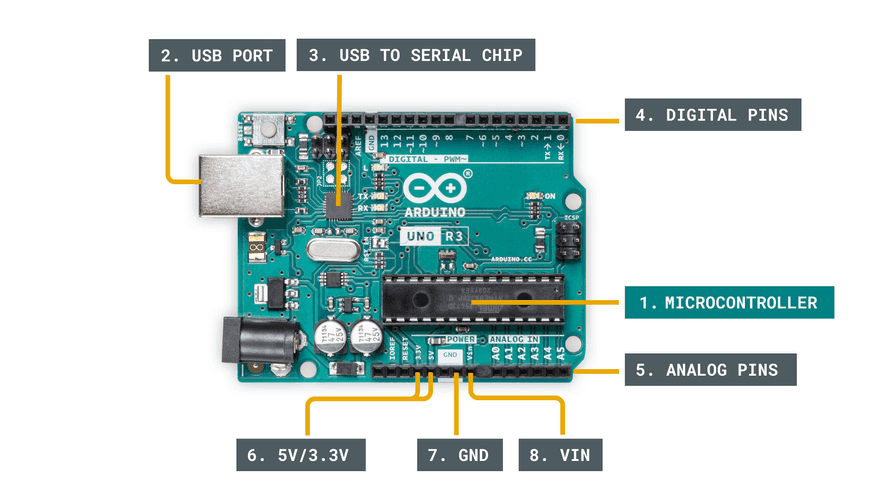
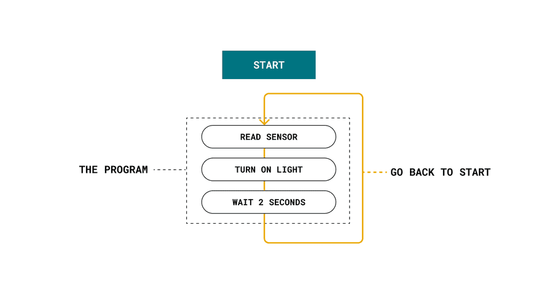
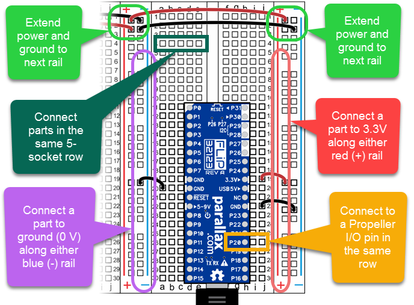
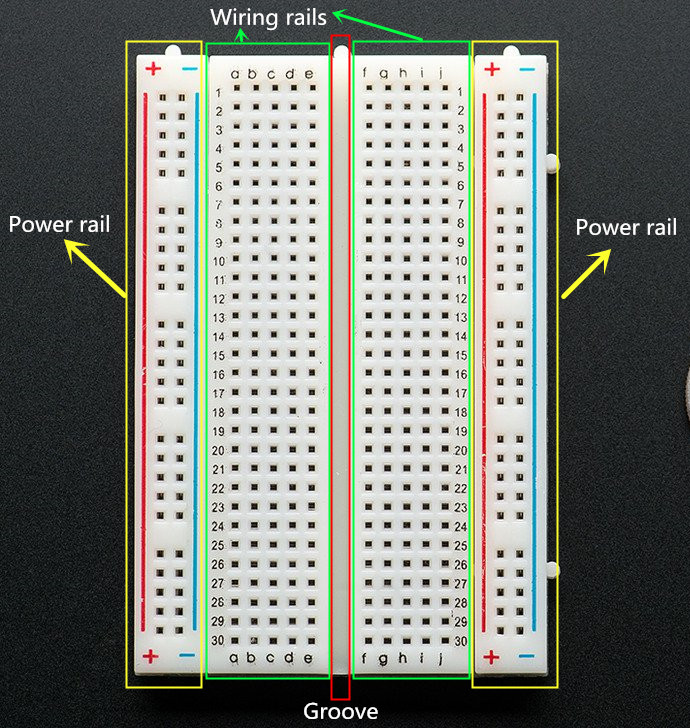
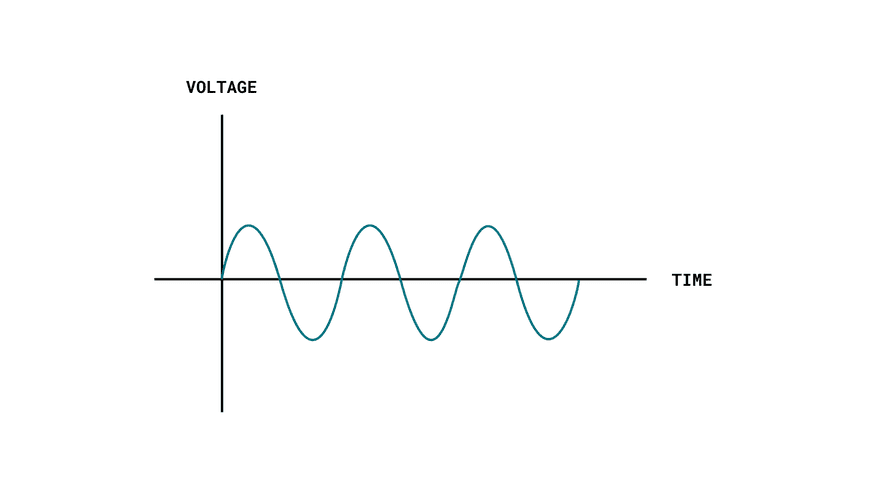
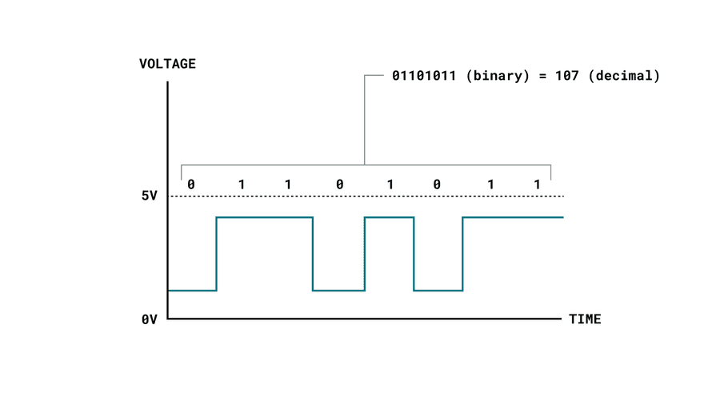

#  Introduction to Arduino

Welcome to **Introduction to Arduino** — a beginner-friendly overview of the Arduino platform.  
This guide will help you understand what Arduino is, how it works, and why it’s one of the best tools to start learning **electronics and programming**.

---

## What Is Arduino?

**Arduino** is an open-source hardware and software platform designed to make working with electronics simple and accessible for everyone.  
It combines a **microcontroller board** (like Arduino Uno) with an **easy-to-use programming environment** (Arduino IDE).

You can use Arduino to build interactive devices that **sense** the environment (using sensors) and **control** other components (like LEDs, motors, and displays).
## Anatomy of an Arduino Board
While each Arduino board differs slightly, several key components are commonly found on almost every board:

1. **Microcontroller** – The brain of the Arduino, where programs are loaded. Think of it as a tiny computer, designed to execute a specific set of tasks.  
2. **USB Port** – Used to connect your Arduino board to a computer.  
3. **USB to Serial Chip** – Translates data from your computer to the microcontroller, allowing you to program the board via USB.  
4. **Digital Pins** – Pins that use digital logic (`0`/`1` or `LOW`/`HIGH`). Commonly used for switches or to turn LEDs on/off.  
5. **Analog Pins** – Pins that can read analog values with 10-bit resolution (0–1023).  
6. **5V / 3.3V Pins** – Provide power to external components.  
7. **GND (Ground)** – Used to complete a circuit; the electrical level is 0 volts.  
8. **VIN (Voltage In)** – For connecting external power supplies.  

> Depending on the Arduino board, you may find additional components, but the items listed above are generally present on most boards.

## Basic Operation

Most Arduino boards are designed to run a **single program** on the microcontroller at a time. This program can be simple, like blinking an LED, or more complex, executing hundreds of actions in a loop. The scope depends on the program you write.

When a program is loaded onto the microcontroller, it **starts execution as soon as the board is powered**. Every Arduino program contains a special function called `loop()`, which repeats indefinitely. Inside this loop, you can:

- Read a sensor.  
- Turn on a light.  
- Check whether a condition is met.  
- Perform all of the above.  

The execution speed of a program is extremely fast unless intentionally slowed down. It depends on the size and complexity of your program, but in general, operations are executed in **microseconds** (one millionth of a second).

## Circuit Basics

Before diving into Arduino projects, it's important to understand some **basic electronics concepts** and how to use a **breadboard** for prototyping circuits.

### Breadboard Overview

A breadboard is a **tool for building temporary circuits** without soldering. It has rows and columns of holes where components and wires can be inserted. Typically:

- **Power Rails** – Long strips along the sides of the breadboard, usually marked with `+` and `-`, used to distribute voltage and ground across the board.  
- **Wiring Rails (Rows/Terminal Strips)** – Horizontal or vertical lines of connected holes where you insert components to create circuits. Each row is electrically connected.  
- **Grooves (Separation Gap)** – The central vertical gap that separates the two sets of rows, allowing ICs and components to be inserted across the gap without shorting connections.

---
## Electronic Signals

All communication between electronic components is facilitated by **electronic signals**. There are two main types of signals used in Arduino projects: **analog** and **digital**.

---

### Analog Signal

An **analog signal** can take any value within a range. On Arduino boards, this range is typically **0–5V** or **0–3.3V**.  

For example, using a **potentiometer** (a variable resistor), we can manually adjust the voltage between 0 and 5V. In Arduino programs, this is represented as a value between **0–1023**, corresponding to a 10-bit resolution.  

When writing analog signals using **Pulse-Width Modulation (PWM)**, the range is usually **0–255**, which corresponds to 8-bit resolution. PWM allows simulating varying voltage levels even on pins that are digitally controlled.

 

### Digital Signal

A **digital signal** only represents two states: **0 or 1**, interpreted as **LOW or HIGH** in Arduino programs. This is the most common signal type in modern electronics.  

You can easily **read or write digital signals** on an Arduino, making them useful for tasks like:

- Reading a button state.  
- Turning an LED or motor on/off.  

Although digital signals may seem simple, they can be extremely powerful. By rapidly switching between HIGH and LOW, we can create **binary sequences** or **bitstreams** to communicate complex information.

---

> Understanding analog and digital signals is fundamental for controlling sensors, actuators, and building more complex circuits with Arduino.

