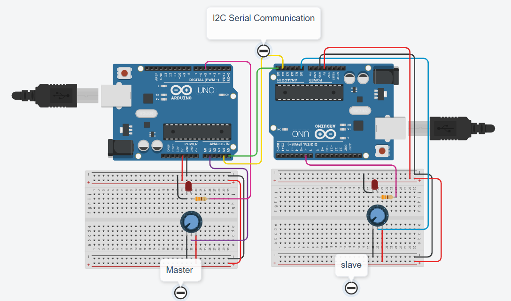

#  I2C Bi-Directional Communication: Two-Way LED Control

This section details the practical implementation of the I2C protocol for **two-way communication** between two Arduino UNO boards. The objective is to establish a system where the **Master's** potentiometer controls the **Slave's** LED, and the **Slave's** potentiometer controls the **Master's** LED.

# Component List

| ID        | Quantity | Component        | Value / Notes                         |
|-----------|----------|------------------|----------------------------------------|
| U1        | 1        | Arduino Uno R3   | Master Controller                     |
| U2        | 1        | Arduino Uno R3   | Slave Controller                      |
| R1, R2    | 2        | Resistor         | 330 Ω (Current Limiting for LEDs)     |
| D3, D4    | 2        | Red LED          | Output Indicators                     |
| RPot1     | 1        | Potentiometer    | 10 kΩ (Master Input)                  |
| RPot2     | 1        | Potentiometer    | 2 kΩ (Slave Input)                    |

## 1. Circuit Setup (Wiring Diagram)

The two Arduinos communicate via the I2C bus.

| Component | Arduino Master | Arduino Slave |
| :--- | :--- | :--- |
| **I2C Bus** | **A4 (SDA)** and **A5 (SCL)** | **A4 (SDA)** and **A5 (SCL)** |
| **Input** | Potentiometer connected to **Analog Pin (A1)** | Potentiometer connected to **Analog Pin (A0)** |
| **Output** | LED connected to **PWM Pin** (e.g., Pin 5) | LED connected to **PWM Pin** (e.g., Pin 6) |
| **Connection** | SDA Master $\leftrightarrow$ SDA Slave; SCL Master $\leftrightarrow$ SCL Slave; **GND Master $\leftrightarrow$ GND Slave** |

> **💡 Note on GND:** It is highly recommended to connect the **GND** pins of both Arduinos to ensure a common voltage reference, especially if they are powered separately.

---

## 2. Master Program Logic (Sender/Requester)

The Master initiates communication, sends its data, and requests the Slave's data.

### Key Steps:

1.  **Initialization:** `#include <Wire.h>` and `Wire.begin();`
2.  **Send Data:**
    * Reads Master's Potentiometer value (mapped to $0-255$).
    * Starts transmission: `Wire.beginTransmission(8);` (Target Slave Address: 8).
    * Sends the brightness value: `Wire.write(brightness_value);`
    * Ends transmission: `Wire.endTransmission();`
3.  **Request Data:**
    * Requests 1 byte from the Slave: `Wire.requestFrom(8, 1);`
    * Reads the received byte and uses it to control the Master's own LED.

---

## 3. Slave Program Logic (Receiver/Responder)

The Slave listens for data from the Master and responds when data is requested.

### Key Steps:

1.  **Initialization:** `Wire.begin(8);` (Sets Slave's unique address to 8).
2.  **Define Handlers:**
    * **Receive Handler:** `Wire.onReceive(receiveEvent);` $\rightarrow$ Executes when Master sends data.
    * **Request Handler:** `Wire.onRequest(requestEvent);` $\rightarrow$ Executes when Master requests data.

#### A. `receiveEvent()`
* Reads the incoming byte (Master's Potentiometer data).
* Uses this value to control the **Slave's LED** brightness (`analogWrite`).

#### B. `requestEvent()`
* Reads the Slave's Potentiometer value (mapped to $0-255$).
* Sends this value back to the Master: `Wire.write(brightness_value);`

---

## 4. Output Verification

After uploading the respective programs to each Arduino, changing either potentiometer should immediately affect the LED on the *other* board, confirming successful bi-directional I2C communication.
