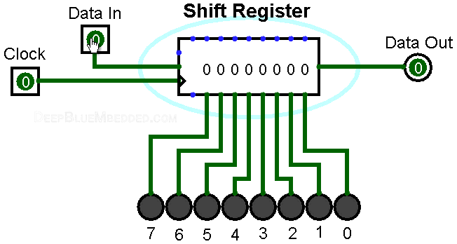
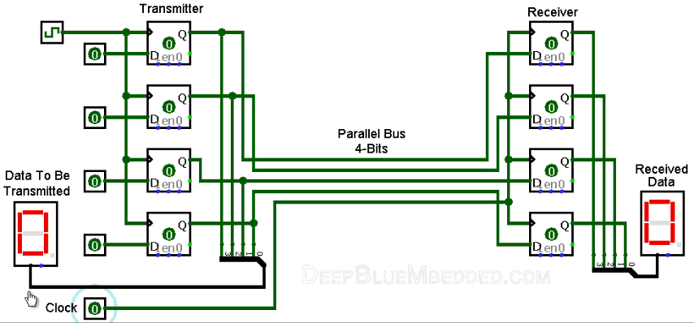

#  Arduino Serial Communication Tutorial

This repository serves as a comprehensive guide to understanding and utilizing the fundamental serial communication protocols in Arduino microcontrollers: **UART**, **SPI**, and **I2C**.

We will cover the basic concepts, associated I/O pins, specifications, differences, and key applications of these protocols in embedded systems projects.

##  1. What is Serial Communication?

In embedded systems and data transmission, **Serial Communication** is the process of sending data sequentially, **bit-by-bit**, over a single communication line (the serial bus).

This method contrasts with **Parallel Communication**, where multiple bits, or even an entire byte, are transferred simultaneously over separate dedicated wires within a single clock cycle.

* **Key Advantage of Serial:** Although fewer data bits are transferred per clock cycle, serial transmission can operate at **much higher frequencies** and over **longer distances**, ultimately resulting in a higher net data transfer rate compared to parallel communication.

###  The Role of Shift Registers

**Shift Registers** are the hardware core (the "working horse") in the implementation of most serial protocols. 
These circuits (typically built from cascaded D-Flip-Flops) shift the data out (or in) one bit at a time with each clock pulse. This allows the internal parallel data of the microcontroller to be converted into the external serial format.

> Here's an animation demonstrating how a shift register works:

###  Serial vs. Parallel Communication

| Feature | Serial Communication | Parallel Communication |
| :--- | :--- | :--- |
| **Relative Speed** | **Faster** (due to higher frequencies) | Slower (due to timing constraints) |
| **Distance Range** | **Much Farther** | Shorter |
| **Transfer Method** | One bit is transmitted at a time | Multiple bits/bytes are transmitted simultaneously |
| **Wires Required** | Few wires (all data passes through the same line) | Multiple wires (each bit has a dedicated wire) |
| **Applications** | Sensors, Modules, **Computer Small Peripherals** | Short-distance high-speed (e.g., older computer printers) |

> Here is an animation that shows you how parallel data transfer is done: 

---

##  2. Applications of Serial Communication Protocols

Serial communication is fundamental to any embedded system application. The main purposes for using these protocols include:

* **External Device/Module Communications:** Connecting the Arduino to sensors, displays, Wi-Fi/Bluetooth modules, and memory chips.
* **Downloading / Updating The Firmware:** Using the serial port (UART) for reprogramming the microcontroller.
* **Console I/O:** Using the Serial Monitor for a simple user interface or system status display.
* **Debugging Interface:** Sending status and error messages from the microcontroller to an external monitor during runtime.

---
# Arduino Serial Communication Ports Comparison

The following table compares the technical features and specifications of the three serial communication ports used in Arduino projects: **UART, I2C, and SPI**.

| Feature | UART | I2C | SPI |
|---|---|---|---|
| **Name** | Universal Asynchronous Receiver/Transmitter | Inter-Integrated Circuit | Serial Peripheral Interface |
| **Interface Diagram** | — | — | — |
| **Pin Names** | TX, RX | SDA, SCL | MOSI, MISO, SCK, SS |
| **Type of Communication** | Asynchronous | Synchronous | Synchronous |
| **Clock** | No | Yes (master generates clock) | Yes (master generates clock) |
| **Number of Masters** | Only 1 Master | Multi-Master Bus | Only 1 Master |
| **Number of Slaves** | Only 1 Slave | Multi-Slave Bus | Multiple Slaves (Each requires 1 SS pin → limits number of slaves) |
| **Data Rate** | Baud rates: 1200–115200 typical; up to 2 Mbps on advanced MCUs | 100 kbps (Standard)   400 kbps (Fast)   1 Mbps (Fast Plus)   3.4 Mbps (High-Speed)   5 Mbps (Ultra-Fast) | Fastest serial interface; up to ~50 Mbps on high-end MCUs |
| **Distance** | Longest (several meters) | Short (bus architecture; limited) | Short (several cm) |
| **Addressing** | Point-to-point, no addressing | 7-bit / 10-bit addressing | Each slave selected via dedicated SS pin |
| **Advantages** | Simple and easy to use   Widely used   No clock needed   Long cable distance | Supports many devices   Multi-master support   Built-in error checking   Low power | Fastest speed   Multi-slave support   Easier than I2C |
| **Disadvantages** | Only point-to-point   Limited devices   Minimal error detection   Slower than others | Limited distance   Slower than SPI   More complex | Requires more pins   More slaves → more I/O   Only 1 master   Short distance |

For more details on each protocol and code examples, please refer to the respective directories:

* [**`UART/`**](https://github.com/MohsenSafari83/Hands-On-Arduino/tree/main/projects/Serial%20Communication/UART)
* [**`SPI/`**](https://github.com/MohsenSafari83/Hands-On-Arduino/tree/main/projects/Serial%20Communication/SPI)
* [**`I2C/`**](https://github.com/MohsenSafari83/Hands-On-Arduino/tree/main/projects/Serial%20Communication/I2C)

  ##  Resources for Further Reading

- [**Serial Protocol Fundamentals (YouTube)**](https://www.youtube.com/watch?v=yz7h5xd18OE)

-  [**CircuitBasics – Electronics & Arduino Tutorials**](https://www.circuitbasics.com/)

-  [**DeepBlueEmbedded – Embedded Systems Tutorials**](https://deepbluembedded.com/)

- [**UART Tutorial (YouTube)**](https://www.youtube.com/watch?v=b5kndEtAKl8)

-  [**Serial Communication Overview – UART, SPI, I2C (YouTube)**](https://www.youtube.com/watch?v=IyGwvGzrqp8&pp=ygUTc2VyaWFsIGNvbXVuaWNhdGlvbg%3D%3D)

