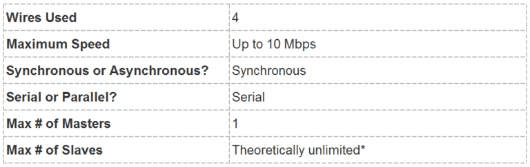

# SPI Protocol (Serial Peripheral Interface)

SPI is a common communication protocol used by various devices such as SD card modules, RFID reader modules, and 2.4 GHz wireless transceivers to interface with microcontrollers.

---

## 1. Key Advantages of SPI

One of the unique benefits of SPI is its ability to transfer data without interruption.  
Data can be sent or received in a continuous stream of any number of bits.  

Unlike I2C and UART, which use specific start and stop conditions to delineate fixed-size data packets, SPI allows for continuous data streaming.

---

## Master–Slave Relationship

Devices communicating via SPI are structured in a Master–Slave relationship:

- **Master:** The controlling device (typically the microcontroller), which generates the clock signal.
- **Slave:** The device that receives commands from the Master (typically a sensor, display, or memory chip).

---

## 2. The Four Wires (SPI Bus)

SPI requires four distinct communication lines for its operation:

| Line | Name | Description |
|------|------|-------------|
| MOSI | Master Output / Slave Input | The line used by the Master to send data to the Slave. |
| MISO | Master Input / Slave Output | The line used by the Slave to send data back to the Master. |
| SCLK | Serial Clock | Clock signal generated by the Master, synchronizing data timing. |
| SS / CS | Slave Select / Chip Select | Used by Master to select/activate a specific Slave. |

### MOSI and MISO Data Flow

- **MOSI:** The Master sends data bit by bit to the Slave (typically MSB first).
- **MISO:** The Slave sends data bit by bit to the Master (typically LSB first).

---

## 3. Clock Signal and Synchronization

The SCLK signal synchronizes the Master's output of data bits with the Slave's sampling of those bits.  
One data bit is transferred per clock cycle, so the data transfer rate is determined by the clock frequency.

Two properties modify the clock signal:

- **Clock Polarity (CPOL):** Determines SCLK idle state (HIGH or LOW).
- **Clock Phase (CPHA):** Determines whether sampling occurs on the first (rising) or second (falling) edge of the cycle.

---

## 4. Slave Selection and Multi-Slave Setup

The Master selects a Slave by pulling its **CS / SS pin LOW**.  
Inactive Slaves hold CS / SS HIGH.

Two common multi-Slave configurations:

1) **Parallel Wiring:**  
   Each Slave has a unique SS line from the Master.

2) **Daisy-Chaining:**  
   One SS pin → serialized device chain.

---

## 5. Data Transfer Steps

1. Master generates SCLK.
2. Master pulls SS/CS LOW to activate desired Slave.
3. Master sends data bit-by-bit via MOSI; Slave reads.
4. If required, Slave sends data back via MISO simultaneously.
5. Master reads incoming bits.

---

## 6. Advantages and Disadvantages of SPI

### ✅ Advantages
- Continuous Data Streaming (no Start/Stop bits)
- Simple addressing
- Higher speed than I2C
- Full Duplex (simultaneous send/receive)

### ❌ Disadvantages
- Uses 4 wires (I2C/UART use fewer)
- No Acknowledge (ACK)
- No built-in error checking
- Limited to **one Master** per bus

---

##  SPI Protocol Summary

| Feature | Description | Key Takeaway |
|---------|-------------|--------------|
| I/O Lines | MOSI, MISO, SCLK, SS/CS | Requires more pins |
| Architecture | Master–Slave (one Master only) | Master controls bus |
| Synchronization | Synchronous, uses SCLK | Fast + configurable |
| Data Flow | Full Duplex | Very fast |
| Addressing | No complex addressing | Uses SS/CS line |
| Transfer Type | Continuous stream | No start/stop bits |

✅ **Fastest transfer speed**  
✅ **Full Duplex capability**  
✅ **No complex addressing system**  

❌ **Uses 4 wires**  
❌ **No ACK/error checking**  
❌ **Only one Master**  

## Resources and Further Reading (SPI Protocol)

This section provides references to technical guides, tutorials, and videos for deeper understanding and practical implementation of the SPI protocol.

| Type | Description | Link |
| :--- | :--- | :--- |
| **Technical Guide** | Basics of the SPI Communication Protocol, covering core functions and concepts. | https://www.circuitbasics.com/basics-of-the-spi-communication-protocol/ |
| **Practical Tutorial** | Comprehensive step-by-step guide on the Serial Peripheral Interface (SPI). | https://learn.sparkfun.com/tutorials/serial-peripheral-interface-spi/all |
| **Video Tutorial** | Tutorial explaining how SPI works and clarifying MOSI/MISO concepts. | https://www.youtube.com/watch?v=IyGwvGzrqp8 |
| **Video Tutorial** | Detailed explanation of SPI wiring and implementation on microcontrollers. | https://www.youtube.com/watch?v=MCi7dCBhVpQ |

