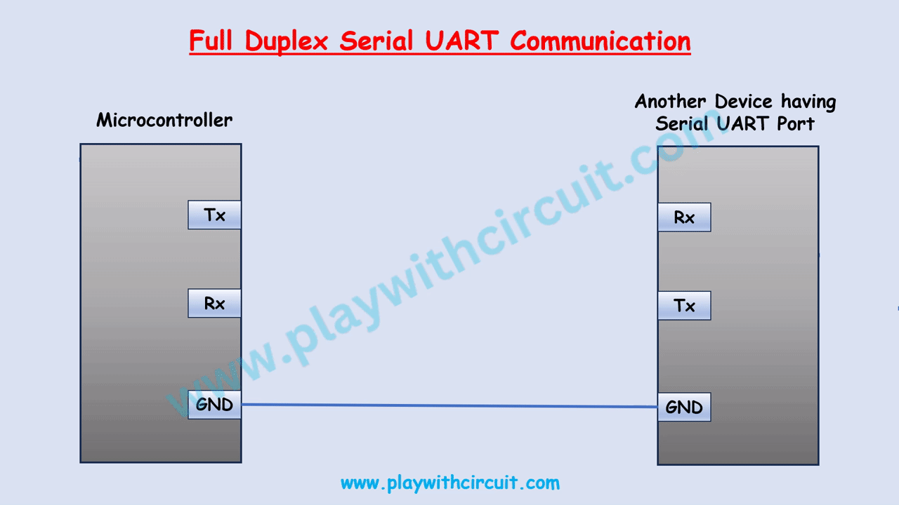
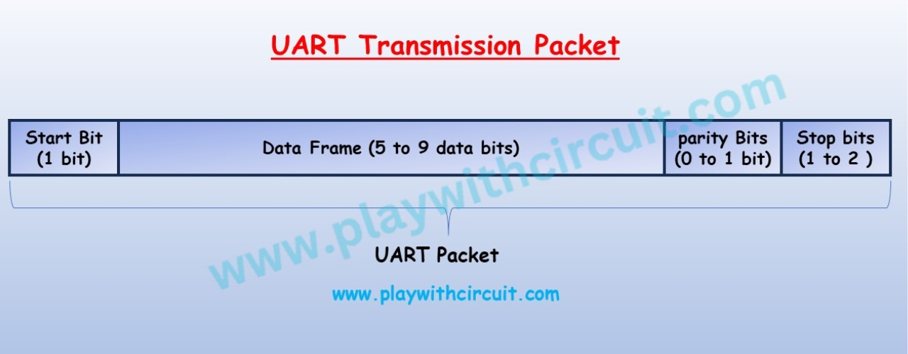
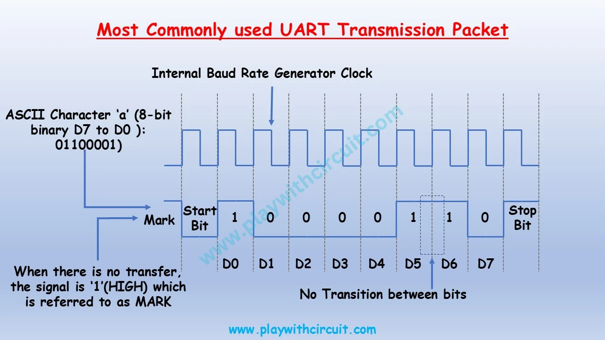

# UART Protocol (Universal Asynchronous Receiver/Transmitter)

UART is **not a communication protocol like SPI or I2C**, but a **hardware circuit** within a microcontroller or an independent IC.  
Its primary purpose is to **transmit and receive serial data**.  
One of the advantages of UART is that it uses only **two wires** for data transfer between devices.

---

## 1) UART Communication Overview

In UART communication, two UARTs communicate directly with each other.

- The transmitting UART converts **parallel data** from a controlling device (e.g., CPU) into **serial form**, sends it sequentially to the receiving UART.
- The receiving UART converts the serial data back into **parallel data**.

###  Core Signals

UART provides a robust, medium-speed, bidirectional communication system using only three signals:

| Signal | Meaning |
|--------|---------|
| **Tx (Transmitter)** | Serial data transmitted (output pin) |
| **Rx (Receiver)** | Serial data received (input pin) |
| **GND** | Ground reference |

---

## 2) Asynchronous Nature & Baud Rate

Unlike SPI and I2C, **no clock signal is shared** between UART devices.  
Instead, each UART has its own **internal clock** to maintain timing.

- The receiving UART starts reading bits at a specific frequency called **Baud Rate**.

### Baud Rate
The baud rate is a measure of how many bits per second a communication channel can transmit. It determines the speed at which data is sent or received in serial communication.

Common baud rate values include 2400, 4800, 9600, 115200 and more. The choice of baud rate depends on the requirements of your specific project and the capabilities of the external device. Both the transmitting and receiving devices need to operate at the same baud rate to ensure data is properly sent and received.

If you set a UART communication channel to a baud rate of 115200, it means that the channel can transmit data at a rate of 115200 bits per second.

### Data Bits
Data bits represent the number of bits in each data byte. Common values are 5, 6, 7, 8 or 9. The most common configuration is 8 data bits, which allows for 256 different values (2^8) in each byte.

>  **Requirement:**  
> Both UARTs must operate at the **same Baud Rate**.  
> A difference larger than ~10% may cause communication failure.

---

## 3) UART Data Transmission  
### Packet Structure

UART transfers data in **packets**.

A packet consists of:
1. **Start Bit**
2. **Data Frame**
3. **Optional Parity Bit**
4. **Stop Bit(s)**

###  Packet Components

| Component | Description |
|-----------|-------------|
| **Start Bit** | Signals the beginning of transmission; line pulled LOW for one bit duration |
| **Data Frame** | Actual data (5–8 bits with parity, or up to 9 bits without parity); LSB sent first |
| **Parity Bit (Optional)** | Error detection bit; indicates even/odd number of “1” bits |
| **Stop Bit(s)** | Signals end of packet; line held HIGH for 1–2 bit durations |

---

##  Error Checking — Parity Bit

The Parity Bit allows UART to detect whether the data was altered during transmission.

- **Even Parity (0):** Data contains an even number of ones
- **Odd Parity (1):** Data contains an odd number of ones

If parity does not match expectations, UART flags a transmission error.

---

## 4) Steps of UART Transmission

1) **Parallel → Serial:**  
   Transmitting UART receives parallel data from the data bus.

2) **Packet Creation:**  
   Start, Parity, and Stop bits are added to the data frame.

3) **Serial Transfer:**  
   Packet is sent bit-by-bit through **Tx → Rx**.  
   Receiver samples the line at the agreed Baud Rate.

4) **Packet Processing:**  
   Receiver removes Start, Parity, and Stop bits.

5) **Serial → Parallel:**  
   Receiver converts the data back to parallel and sends it to the system bus.
---  
## Understanding the UART Packet Structure

---

## 5) Advantages & Disadvantages of UART

UART is ideal for simple, point-to-point data transmission.

### ✅ Advantages
- Uses only **two wires** (Tx & Rx)
- No clock signal required (asynchronous)
- Supports **Parity Bit** for simple error detection
- Configurable data packet structure (if both sides match)
- Well-documented and widely used

### ❌ Disadvantages
- Data frame size limited to **maximum 9 bits**
- Does not support multi-master or multi-slave (only point-to-point)
- Both devices must be configured with the same Baud Rate

