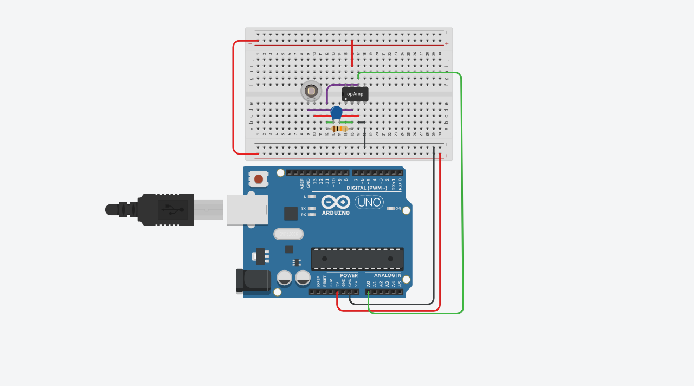
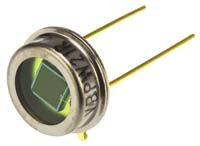
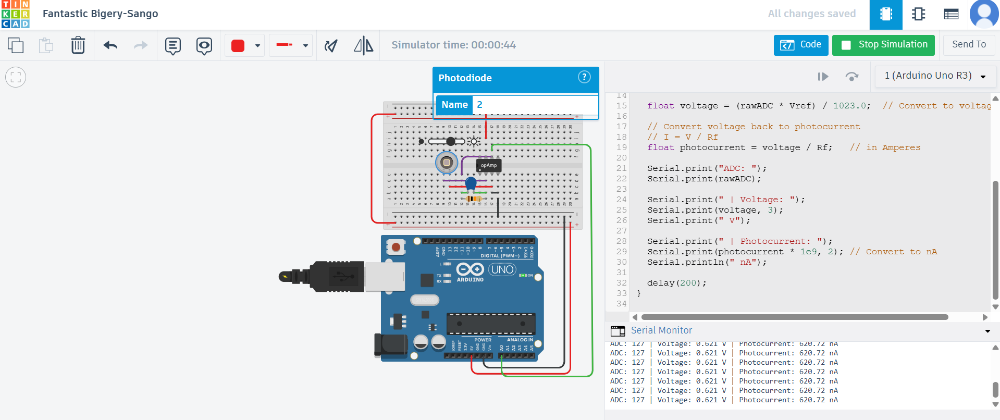

# Arduino Photodiode + Op-Amp Light Sensor Circuit

# Arduino Photodiode Light Sensor System

## Introduction
A **photodiode** is a semiconductor device that converts light energy (photons) into electrical energy (electrons). When exposed to light, it generates a small current or voltage that can be amplified and measured. Small photodiodes are typically used for **light intensity sensing**, while large-area photodiodes are used for **solar power generation**.

In this project, we will be using the **BPW34 Photodiode** with an **Op-Amp conditioning circuit** and **Arduino** to build a light-intensity measurement system.

## Project Scope

This project demonstrates:

- Using the **BPW34 Photodiode** in a **transimpedance amplifier (Op-Amp) circuit**
- Amplifying its response for **Arduino ADC measurement**
- Creating a functional and precise **light-intensity sensor**

The result provides a strong foundation for more advanced applications such as optical communication or directional light tracking.

## Photodiode Applications

Photodiodes are used in a wide range of optoelectronic systems including:

- Solar tracking systems
- Light intensity meters (Lux sensors)
- Position sensing modules
- Photo-interrupters and object detectors
- High-speed optical communication
- Medical sensors such as pulse detection
- Security laser alarms

> this is what look like a Photodiode

## Photodiode Light Sensor Output

The image below shows the **real output of the Arduino + Photodiode + Op-Amp circuit**.  

**Notes:**
- The voltage and current vary according to the light intensity falling on the photodiode.
- This visualization helps in verifying the circuit operation and calibrating the feedback resistor for desired sensitivity.
## Bill of Materials (BOM)

| Name | Quantity | Component |
|------|----------|-----------|
| U1   | 1        | Arduino Uno R3 |
| U2   | 1        | Photodiode (BPW34) |
| U3   | 1        | 741 Operational Amplifier |
| R1   | 1        | 10 kΩ Resistor |
| C1   | 1        | 100 nF Capacitor |

---
## Circuit Connections

- **Photodiode:**
  - Negative pin → Op-Amp **IN−**
  - Positive pin → Op-Amp **IN+** (connected to GND)
  
- **Feedback Network:**
  - Resistor between **IN−** and **OUT** (Rf)
  - 100 nF capacitor in parallel with the resistor for stability and noise reduction

- **Op-Amp Power Supply:**
  - VCC+ → +5 V
  - VCC− → GND

- **Arduino Connection:**
  - Op-Amp **OUT** → Arduino **Analog Pin A0**

**Notes:**
- Ensure the Op-Amp output remains within 0–5V to protect the Arduino ADC.
- If the output can go negative, consider using a **virtual ground** or a **level-shifting circuit**.
- Choose an appropriate feedback resistor (Rf) to scale the photocurrent into a measurable voltage.
- Use short wires and proper grounding to minimize measurement noise.
---
| Component | Datasheet |
|-----------|-----------|
| Photodiode (BPW34) | [Datasheet](https://www.vishay.com/docs/81584/bpw34.pdf) |
| 741 Op-Amp | [Datasheet](https://www.ti.com/lit/ds/symlink/ua741.pdf) |

##  References

1. [Arduino Photodiode Light Sensor (BPW34) Circuit & Code Example – DeepBlue Embedded](https://deepbluembedded.com/arduino-photodiode-light-sensor-bpw34-circuit-code-example/)
2. [Light Sensor including Photocell and LDR Sensor – Electronics Tutorials](https://www.electronics-tutorials.ws/io/io_4.html)

